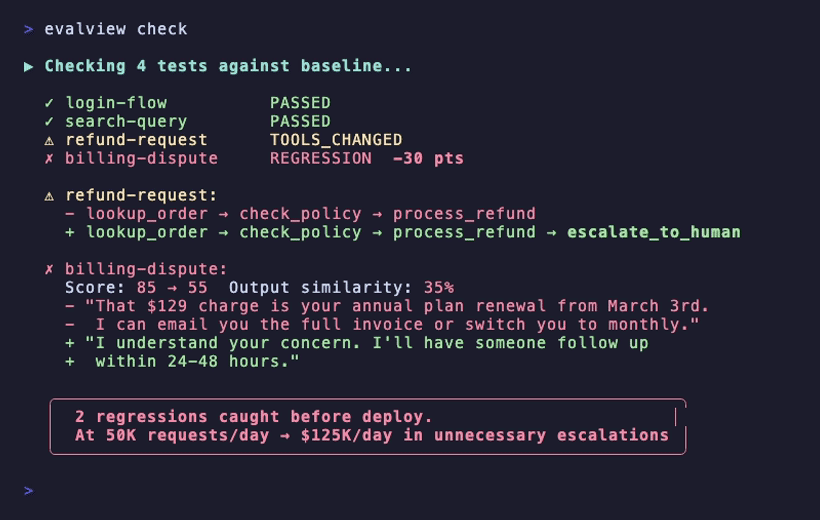

# EvalView — Catch Agent Regressions Before You Ship

> Your agent worked yesterday. Today it's broken. What changed?

**EvalView catches agent regressions** — tool changes, output changes, cost spikes, and latency spikes — before they hit production.

### Quick Start

```bash
pip install evalview
evalview demo          # Watch a regression get caught (no API key needed)
```

**Don't remember commands?** Just ask:
```bash
evalview chat          # AI assistant for EvalView (free, runs locally)
```

Ready to test your own agent? See [Try it in 2 minutes](#try-it-in-2-minutes-no-db-required).

[](https://github.com/hidai25/eval-view/actions/workflows/ci.yml)
[](https://pypi.org/project/evalview/)
[](https://opensource.org/licenses/Apache-2.0)
[](https://github.com/hidai25/eval-view/stargazers)
[](https://github.com/hidai25/eval-view/network/members)

[](https://pypi.org/project/evalview/)
[](https://www.npmjs.com/package/@evalview/node)

---

## The Problem

You changed a prompt. Or swapped models. Or updated a tool.

Now your agent:
- ❌ Calls different tools than before
- ❌ Returns different outputs for the same input
- ❌ Costs 3x more than yesterday
- ❌ Takes 5 seconds instead of 500ms

You don't find out until users complain.

## The Solution

**EvalView detects these regressions in CI — before you deploy.**

```bash
# Save a working run as your baseline
evalview golden save .evalview/results/xxx.json

# Every future run compares against it
evalview run --diff  # Fails on REGRESSION
```

---

## What EvalView Catches

| Regression Type | What It Means | Status |
|-----------------|---------------|--------|
| **REGRESSION** | Score dropped — agent got worse | 🔴 Fix before deploy |
| **TOOLS_CHANGED** | Agent uses different tools now | 🟡 Review before deploy |
| **OUTPUT_CHANGED** | Same tools, different response | 🟡 Review before deploy |
| **PASSED** | Matches baseline | 🟢 Ship it |

EvalView runs in CI. When it detects a regression, your deploy fails. You fix it before users see it.

<p align="center">
  
</p>

---

**Who is EvalView for?**

- **LangGraph / CrewAI teams** shipping agents to production
- **Solo devs** tired of "it worked yesterday" conversations
- **Platform teams** who need CI gates before agent deploys

Already using LangSmith or Langfuse? Good. Use them to *see* what happened. Use EvalView to **block it from shipping.**

---

## What is EvalView?

EvalView is a **regression testing framework for AI agents**.

It lets you:

- **Save golden baselines** — snapshot a working agent run
- **Detect regressions automatically** — tool changes, output changes, cost spikes, latency spikes
- **Block bad deploys in CI** — fail the build when behavior regresses
- Plug into **LangGraph, CrewAI, OpenAI Assistants, Anthropic Claude, MCP servers**, and more

Think: _"Regression testing for agents. Like screenshot testing, but for behavior."_

> **Note:** LLM-as-judge evaluations are probabilistic. Results may vary between runs. Use [Statistical Mode](#statistical-mode-variance-testing) for reliable pass/fail decisions.

---

## Core Workflow

```bash
# 1. Run tests and capture a baseline
evalview run
evalview golden save .evalview/results/latest.json

# 2. Make changes to your agent (prompt, model, tools)

# 3. Run with diff to catch regressions
evalview run --diff

# 4. CI integration with configurable strictness
evalview run --diff --fail-on REGRESSION                    # Default: only fail on score drops
evalview run --diff --fail-on REGRESSION,TOOLS_CHANGED      # Stricter: also fail on tool changes
evalview run --diff --strict                                # Strictest: fail on any change
```

**Exit codes:**
| Scenario | Exit Code |
|----------|-----------|
| All tests pass, all PASSED | 0 |
| All tests pass, only warn-on statuses | 0 (with warnings) |
| Any test fails OR any fail-on status | 1 |
| Execution errors (network, timeout) | 2 |

---

## Add to CI in 60 seconds

```yaml
# .github/workflows/evalview.yml
name: Agent Tests
on: [push, pull_request]

jobs:
  test:
    runs-on: ubuntu-latest
    steps:
      - uses: actions/checkout@v4
      - uses: hidai25/eval-view@v0.2.0
        with:
          openai-api-key: ${{ secrets.OPENAI_API_KEY }}
          diff: true              # Compare against golden baselines
          fail-on: 'REGRESSION'   # Block merge on regression
```

That's it. Tests run on every PR, block merges on regression.

---

## EvalView vs Manual Testing

| | Manual Testing | EvalView |
|---|---|---|
| Catches hallucinations | No | **Yes** |
| Tracks token cost | No | **Automatic** |
| Runs in CI/CD | Hard | **Built-in** |
| Detects regressions | No | **Golden traces + `--diff`** |
| Tests tool calls | Manual inspection | **Automated** |
| Flexible tool matching | Exact names only | **Categories (intent-based)** |
| Latency tracking | No | **Per-test thresholds** |
| Handles flaky LLMs | No | **Statistical mode** |

---

## 3 Copy-Paste Recipes

**Budget regression test** — fail if cost exceeds threshold:
```yaml
name: "Cost check"
input:
  query: "Summarize this document"
thresholds:
  min_score: 70
  max_cost: 0.05
```

**Tool-call required test** — fail if agent doesn't use the tool:
```yaml
name: "Must use search"
input:
  query: "What's the weather in NYC?"
expected:
  tools:
    - web_search
thresholds:
  min_score: 80
```

**Hallucination check** — fail if agent makes things up:
```yaml
name: "No hallucinations"
input:
  query: "What's our refund policy?"
expected:
  tools:
    - retriever
thresholds:
  min_score: 80
checks:
  hallucination: true
```

**Regression detection** — fail if behavior changes from baseline:
```bash
# Save a good run as baseline
evalview golden save .evalview/results/xxx.json

# Future runs compare against it
evalview run --diff  # Fails on REGRESSION or TOOLS_CHANGED
```

---

## Suite Types: Capability vs Regression

Not all test failures are equal. Tag your tests to distinguish **expected** failures from **critical** regressions:

```yaml
# Capability test — measuring what the agent CAN do (failures expected)
name: complex-multi-step-reasoning
suite_type: capability
thresholds:
  min_score: 70

# Regression test — verifying it STILL works (failures = red alert)
name: login-flow
suite_type: regression
thresholds:
  min_score: 90
```

Console output reflects this:

```
┌─ Test Results ─────────────────────────────────────┐
│ login-flow          regression  🚨 REGRESSION      │  ← Fix immediately
│ checkout-process    regression  ✅ PASSED          │
│ complex-reasoning   capability  ⚡ CLIMBING        │  ← Expected, keep improving
│ edge-case-handling  capability  ✅ PASSED          │
└────────────────────────────────────────────────────┘

By Suite Type:
  Regression:  1/2 (⚠️ 1 regressions!)
  Capability:  1/2 (hill climbing)
```

**Why this matters:** Regression failures block deploys. Capability failures track progress.

---

## Try it in 2 minutes (no DB required)

You don't need a database, Docker, or any extra infra to start.

```bash
pip install evalview

# Set your OpenAI API key (for LLM-as-judge evaluation)
export OPENAI_API_KEY='your-key-here'

# Scaffold a test for YOUR agent
evalview quickstart
```

You'll see a full run with:

- A demo agent spinning up
- A test case created for you
- A config file wired up
- A scored test: tools used, output quality, cost, latency

### Run examples directly (no config needed)

Test cases with `adapter` and `endpoint` defined work without any setup:

```bash
# Run any example directly
evalview run examples/langgraph/test-case.yaml
evalview run examples/ollama/langgraph-ollama-test.yaml

# Your own test case with adapter/endpoint works the same way
evalview run my-test.yaml
```

### Free local evaluation with Ollama

Don't want to pay for API calls? Use Ollama for free local LLM-as-judge:

```bash
# Install Ollama and pull a model
curl -fsSL https://ollama.ai/install.sh | sh
ollama pull llama3.2

# Run tests with free local evaluation
evalview run --judge-provider ollama --judge-model llama3.2
```

No API key needed. Runs entirely on your machine.

<details>
<summary>📺 Example quickstart output</summary>

```
━━━ EvalView Quickstart ━━━

Step 1/4: Creating demo agent...
✅ Demo agent created

Step 2/4: Creating test case...
✅ Test case created

Step 3/4: Creating config...
✅ Config created

Step 4/4: Starting demo agent and running test...
✅ Demo agent running

Running test...

Test Case: Quickstart Test
Score: 95.0/100
Status: ✅ PASSED

Tool Accuracy: 100%
  Expected tools:  calculator
  Used tools:      calculator

Output Quality: 90/100

Performance:
  Cost:    $0.0010
  Latency: 27ms

🎉 Quickstart complete!
```
</details>

---

## Early Adopter Program

**First 10 teams get white-glove setup.** Free.

I'll personally configure your YAML tests + CI integration. You tell me what's broken.

- [Claim a spot →](https://github.com/hidai25/eval-view/discussions)
- Email: hidai@evalview.com

3 spots left.

---

## Do I need a database?

**No.**

By default, EvalView runs in a basic, no-DB mode:

- No external database
- Tests run in memory
- Results are printed in a rich terminal UI

You can still use it locally and in CI (exit codes + JSON reports).

That's enough to:
- Write and debug tests for your agents
- Add a "fail the build if this test breaks" check to CI/CD

If you later want history, dashboards, or analytics, you can plug in a database and turn on the advanced features:
- Store all runs over time
- Compare behavior across branches / releases
- Track cost / latency trends
- Generate HTML reports for your team

Database config is optional – EvalView only uses it if you enable it in config.

---

## Why EvalView?

- **Fully Open Source** – Apache 2.0 licensed, runs entirely on your infra, no SaaS lock-in
- **Framework-agnostic** – Works with LangGraph, CrewAI, OpenAI, Anthropic, or any HTTP API
- **Production-ready** – Parallel execution, CI/CD integration, configurable thresholds
- **Extensible** – Custom adapters, evaluators, and reporters for your stack

---

## Behavior Coverage (not line coverage)

Line coverage doesn't work for LLMs. Instead, EvalView focuses on **behavior coverage**:

| Dimension | What it measures |
|-----------|------------------|
| **Tasks covered** | Which real-world scenarios have tests? |
| **Tools exercised** | Are all your agent's tools being tested? |
| **Paths hit** | Are multi-step workflows tested end-to-end? |
| **Eval dimensions** | Are you checking correctness, safety, cost, latency? |

**The loop:** weird prod session → turn it into a regression test → it shows up in your coverage.

```bash
# Compact summary with deltas vs last run + regression detection
evalview run --summary
```

```
━━━ EvalView Summary ━━━
Suite: analytics_agent
Tests: 7 passed, 2 failed

Failures:
  ✗ cohort: large result set     cost +240%
  ✗ doc QA: long context         missing tool: chunking

Deltas vs last run:
  Tokens:  +188%  ↑
  Latency: +95ms  ↑
  Cost:    +$0.12 ↑

⚠️  Regressions detected
```

```bash
# Behavior coverage report
evalview run --coverage
```

```
━━━ Behavior Coverage ━━━
Suite: analytics_agent

Tasks:      9/9 scenarios (100%)
Tools:      6/8 exercised (75%)
            missing: chunking, summarize
Paths:      3/3 multi-step workflows (100%)
Dimensions: correctness ✓, output ✓, cost ✗, latency ✓, safety ✓

Overall:    92% behavior coverage
```

---

## Golden Traces (Regression Detection)

**Problem:** Your agent worked yesterday. Today it doesn't. What changed?

**Solution:** Save "golden" baselines, detect regressions automatically.

### How It Works

```bash
# 1. Run your tests
evalview run

# 2. Save a passing run as your golden baseline
evalview golden save .evalview/results/20241201_143022.json

# 3. On future runs, compare against golden
evalview run --diff
```

When you run with `--diff`, EvalView compares every test against its golden baseline and flags:

| Status | What It Means | Action |
|--------|---------------|--------|
| **PASSED** | Matches baseline | 🟢 Ship it |
| **TOOLS_CHANGED** | Agent uses different tools | 🟡 Review before deploy |
| **OUTPUT_CHANGED** | Same tools, different response | 🟡 Review before deploy |
| **REGRESSION** | Score dropped significantly | 🔴 Fix before deploy |

### Example Output

```
━━━ Golden Diff Report ━━━

✓ PASSED           test-stock-analysis
⚠ TOOLS_CHANGED    test-customer-support    added: web_search
~ OUTPUT_CHANGED   test-summarizer          similarity: 78%
✗ REGRESSION       test-code-review         score dropped 15 points

1 REGRESSION - fix before deploy
1 TOOLS_CHANGED - review before deploy
```

### Golden Commands

```bash
# Save a result as golden baseline
evalview golden save .evalview/results/xxx.json

# Save with notes
evalview golden save result.json --notes "Baseline after v2.0 refactor"

# Save only specific test from a multi-test result
evalview golden save result.json --test "stock-analysis"

# List all golden traces
evalview golden list

# Show details of a golden trace
evalview golden show test-stock-analysis

# Delete a golden trace
evalview golden delete test-stock-analysis
```

**Use case:** Add `evalview run --diff` to CI. Block deploys when behavior regresses.

---

## Tool Categories (Flexible Matching)

**Problem:** Your test expects `read_file`. Agent uses `bash cat`. Test fails. Both are correct.

**Solution:** Test by *intent*, not exact tool name.

### Before (Brittle)

```yaml
expected:
  tools:
    - read_file      # Fails if agent uses bash, text_editor, etc.
```

### After (Flexible)

```yaml
expected:
  categories:
    - file_read      # Passes for read_file, bash cat, text_editor, etc.
```

### Built-in Categories

| Category | Matches |
|----------|---------|
| `file_read` | read_file, bash, text_editor, cat, view, str_replace_editor |
| `file_write` | write_file, bash, text_editor, edit_file, create_file |
| `file_list` | list_directory, bash, ls, find, directory_tree |
| `search` | grep, ripgrep, bash, search_files, code_search |
| `shell` | bash, shell, terminal, execute, run_command |
| `web` | web_search, browse, fetch_url, http_request, curl |
| `git` | git, bash, git_commit, git_push, github |
| `python` | python, bash, python_repl, execute_python, jupyter |

### Custom Categories

Add project-specific categories in `config.yaml`:

```yaml
# .evalview/config.yaml
tool_categories:
  database:
    - postgres_query
    - mysql_execute
    - sql_run
  my_custom_api:
    - internal_api_call
    - legacy_endpoint
```

**Why this matters:** Different agents use different tools for the same task. Categories let you test behavior, not implementation.

---

## What it does (in practice)

- **Write test cases in YAML** – Define inputs, required tools, and scoring thresholds
- **Automated evaluation** – Tool accuracy, output quality (LLM-as-judge), hallucination checks, cost, latency
- **Run in CI/CD** – JSON/HTML reports + proper exit codes for blocking deploys

```yaml
# tests/test-cases/stock-analysis.yaml
name: "Stock Analysis Test"
input:
  query: "Analyze Apple stock performance"

expected:
  tools:
    - fetch_stock_data
    - analyze_metrics
  output:
    contains:
      - "revenue"
      - "earnings"

thresholds:
  min_score: 80
  max_cost: 0.50
  max_latency: 5000
```

```bash
$ evalview run

✅ Stock Analysis Test - PASSED (score: 92.5)
   Cost: $0.0234 | Latency: 3.4s
```

---

## Generate 1000 Tests from 1

**Problem:** Writing tests manually is slow. You need volume to catch regressions.

**Solution:** Auto-generate test variations.

### Option 1: Expand from existing tests

```bash
# Take 1 test, generate 100 variations
evalview expand tests/stock-test.yaml --count 100

# Focus on specific scenarios
evalview expand tests/stock-test.yaml --count 50 \
  --focus "different tickers, edge cases, error scenarios"
```

Generates variations like:
- Different inputs (AAPL → MSFT, GOOGL, TSLA...)
- Edge cases (invalid tickers, empty input, malformed requests)
- Boundary conditions (very long queries, special characters)

### Option 2: Record from live interactions

```bash
# Use your agent normally, auto-generate tests
evalview record --interactive
```

EvalView captures:
- Query → Tools called → Output
- Auto-generates test YAML
- Adds reasonable thresholds

**Result:** Go from 5 manual tests → 500 comprehensive tests in minutes.

---

## Connect to your agent

Already have an agent running? Use `evalview connect` to auto-detect it:

```bash
# Start your agent (LangGraph, CrewAI, whatever)
langgraph dev

# Auto-detect and connect
evalview connect  # Scans ports, detects framework, configures everything

# Run tests
evalview run
```

Supports 7+ frameworks with automatic detection:
LangGraph • CrewAI • OpenAI Assistants • Anthropic Claude • AutoGen • Dify • Custom APIs

---

## EvalView Cloud (Coming Soon)

We're building a hosted version:

- **Dashboard** - Visual test history, trends, and pass/fail rates
- **Teams** - Share results and collaborate on fixes
- **Alerts** - Slack/Discord notifications on failures
- **Regression detection** - Automatic alerts when performance degrades
- **Parallel runs** - Run hundreds of tests in seconds

**[Join the waitlist](https://form.typeform.com/to/EQO2uqSa)** - be first to get access

---

## Features

- **Golden traces** - Save baselines, detect regressions with `--diff` ([docs](#golden-traces-regression-detection))
- **Tool categories** - Flexible matching by intent, not exact tool names ([docs](#tool-categories-flexible-matching))
- **Suite types** - Distinguish capability tests (hill climbing) from regression tests (safety net) ([docs](#suite-types-capability-vs-regression))
- **Flexible sequence matching** - 3 modes: subsequence, exact, unordered ([docs](#sequence-matching-modes))
- **pass@k / pass^k metrics** - Industry-standard reliability metrics ([docs](#reliability-metrics-passk-vs-passk))
- **Chat mode** - AI assistant for EvalView commands (`evalview chat`)
- **Test Expansion** - Generate 100+ test variations from a single seed test
- **Test Recording** - Auto-generate tests from live agent interactions
- **YAML-based test cases** - Write readable, maintainable test definitions
- **Parallel execution** - Run tests concurrently (8x faster by default)
- **Multiple evaluation metrics** - Tool accuracy, sequence correctness, output quality, cost, and latency
- **LLM-as-judge** - Automated output quality assessment
- **Cost tracking** - Automatic cost calculation based on token usage
- **Universal adapters** - Works with any HTTP or streaming API
- **Rich console output** - Beautiful, informative test results
- **JSON & HTML reports** - Interactive HTML reports with Plotly charts
- **Retry logic** - Automatic retries with exponential backoff for flaky tests
- **Watch mode** - Re-run tests automatically on file changes
- **Configurable weights** - Customize scoring weights globally or per-test
- **Statistical mode** - Run tests N times, get variance metrics and flakiness scores
- **Skills testing** - Validate and test Claude Code / OpenAI Codex skills against [official Anthropic spec](#skills-testing-claude-code--openai-codex)

---

## Installation

```bash
# Install (includes skills testing)
pip install evalview

# With HTML reports (Plotly charts)
pip install evalview[reports]

# With watch mode
pip install evalview[watch]

# All optional features
pip install evalview[all]
```

## CLI Reference

### `evalview quickstart`

The fastest way to try EvalView. Creates a demo agent, test case, and runs everything.

### `evalview run`

Run test cases.

```bash
evalview run [OPTIONS]

Options:
  --pattern TEXT         Test case file pattern (default: *.yaml)
  -t, --test TEXT        Run specific test(s) by name
  --diff                 Compare against golden traces, detect regressions
  --verbose              Enable verbose logging
  --sequential           Run tests one at a time (default: parallel)
  --max-workers N        Max parallel executions (default: 8)
  --max-retries N        Retry flaky tests N times (default: 0)
  --watch                Re-run tests on file changes
  --html-report PATH     Generate interactive HTML report
  --summary              Compact output with deltas vs last run + regression detection
  --coverage             Show behavior coverage: tasks, tools, paths, eval dimensions
  --judge-model TEXT     Model for LLM-as-judge (e.g., gpt-5, sonnet, llama-70b)
  --judge-provider TEXT  Provider for LLM-as-judge (openai, anthropic, huggingface, gemini, grok, ollama)
```

**Model shortcuts** - Use simple names, they auto-resolve:
| Shortcut | Full Model |
|----------|------------|
| `gpt-5` | `gpt-5` |
| `sonnet` | `claude-sonnet-4-5-20250929` |
| `opus` | `claude-opus-4-5-20251101` |
| `llama-70b` | `meta-llama/Llama-3.1-70B-Instruct` |
| `gemini` | `gemini-3.0` |
| `llama3.2` | `llama3.2` (Ollama) |

```bash
# Examples
evalview run --judge-model gpt-5 --judge-provider openai
evalview run --judge-model sonnet --judge-provider anthropic
evalview run --judge-model llama-70b --judge-provider huggingface  # Free!
evalview run --judge-model llama3.2 --judge-provider ollama  # Free & Local!
```

### `evalview expand`

Generate test variations from a seed test case.

```bash
evalview expand TEST_FILE --count 100 --focus "edge cases"
```

### `evalview record`

Record agent interactions and auto-generate test cases.

```bash
evalview record --interactive
```

### `evalview report`

Generate report from results.

```bash
evalview report .evalview/results/20241118_004830.json --detailed --html report.html
```

### `evalview golden`

Manage golden traces for regression detection.

```bash
# Save a test result as the golden baseline
evalview golden save .evalview/results/xxx.json
evalview golden save result.json --notes "Post-refactor baseline"
evalview golden save result.json --test "specific-test-name"

# List all golden traces
evalview golden list

# Show details of a golden trace
evalview golden show test-name

# Delete a golden trace
evalview golden delete test-name
evalview golden delete test-name --force
```

---

## Statistical Mode (Variance Testing)

LLMs are non-deterministic. A test that passes once might fail the next run. Statistical mode addresses this by running tests multiple times and using statistical thresholds for pass/fail decisions.

### Enable Statistical Mode

Add `variance` config to your test case:

```yaml
# tests/test-cases/my-test.yaml
name: "My Agent Test"
input:
  query: "Analyze the market trends"

expected:
  tools:
    - fetch_data
    - analyze

thresholds:
  min_score: 70

  # Statistical mode config
  variance:
    runs: 10           # Run test 10 times
    pass_rate: 0.8     # 80% of runs must pass
    min_mean_score: 70 # Average score must be >= 70
    max_std_dev: 15    # Score std dev must be <= 15
```

### What You Get

- **Pass rate** - Percentage of runs that passed
- **pass@k / pass^k** - Industry-standard reliability metrics (see below)
- **Score statistics** - Mean, std dev, min/max, percentiles, confidence intervals
- **Flakiness score** - 0 (stable) to 1 (flaky) with category labels
- **Contributing factors** - Why the test is flaky (score variance, tool inconsistency, etc.)

### Reliability Metrics: pass@k vs pass^k

Two metrics that tell you different things:

| Metric | Question it answers | High = |
|--------|---------------------|--------|
| **pass@k** | "Will it work if I give it a few tries?" | Usually finds a solution |
| **pass^k** | "Will it work reliably every time?" | Consistent and reliable |

```
Reliability Metrics:
  pass@10:       99.9% (usually finds a solution)
  pass^10:       2.8% (unreliable)
```

This example shows an agent that *eventually* works but isn't production-ready.

### Example Output

```
Statistical Evaluation: My Agent Test
PASSED

┌─ Run Summary ─────────────────────────┐
│  Total Runs:     10                   │
│  Passed:         8                    │
│  Failed:         2                    │
│  Pass Rate:      80% (required: 80%)  │
└───────────────────────────────────────┘

Score Statistics:
  Mean:      79.86    95% CI: [78.02, 81.70]
  Std Dev:   2.97     ▂▂▁▁▁ Low variance
  Min:       75.5
  Max:       84.5

┌─ Flakiness Assessment ────────────────┐
│  Flakiness Score: 0.12 ██░░░░░░░░     │
│  Category:        low_variance        │
│  Pass Rate:       80%                 │
└───────────────────────────────────────┘
```

See [examples/statistical-mode-example.yaml](examples/statistical-mode-example.yaml) for a complete example.

---

## Evaluation Metrics

| Metric | Weight | Description |
|--------|--------|-------------|
| **Tool Accuracy** | 30% | Checks if expected tools were called |
| **Output Quality** | 50% | LLM-as-judge evaluation |
| **Sequence Correctness** | 20% | Validates tool call order (flexible matching) |
| **Cost Threshold** | Pass/Fail | Must stay under `max_cost` |
| **Latency Threshold** | Pass/Fail | Must complete under `max_latency` |

Weights are configurable globally or per-test.

### Sequence Matching Modes

By default, EvalView uses **flexible sequence matching** — your agent won't fail just because it used extra tools:

| Mode | Behavior | Use When |
|------|----------|----------|
| `subsequence` (default) | Expected tools in order, extras allowed | Most cases — agents can think/verify without penalty |
| `exact` | Exact match required | Strict compliance testing |
| `unordered` | Tools called, order doesn't matter | Order-independent workflows |

```yaml
# Per-test override
adapter_config:
  sequence_mode: unordered
```

---

## CI/CD Integration

EvalView is CLI-first. You can run it locally or add to CI.

### GitHub Action (Recommended)

Use the official EvalView GitHub Action for the simplest setup:

```yaml
name: EvalView Agent Tests

on: [push, pull_request]

jobs:
  test-agents:
    runs-on: ubuntu-latest
    steps:
      - uses: actions/checkout@v4

      - name: Run EvalView
        uses: hidai25/eval-view@v0.2.0
        with:
          openai-api-key: ${{ secrets.OPENAI_API_KEY }}
          diff: true
          fail-on: 'REGRESSION'
```

#### Action Inputs

| Input | Description | Default |
|-------|-------------|---------|
| `openai-api-key` | OpenAI API key for LLM-as-judge | - |
| `anthropic-api-key` | Anthropic API key (optional) | - |
| `diff` | Compare against golden baselines | `false` |
| `fail-on` | Statuses that fail CI (REGRESSION, TOOLS_CHANGED, OUTPUT_CHANGED) | `REGRESSION` |
| `config-path` | Path to config file | `.evalview/config.yaml` |
| `filter` | Filter tests by name pattern | - |
| `max-workers` | Parallel workers | `4` |
| `max-retries` | Retry failed tests | `2` |
| `fail-on-error` | Fail workflow on test failure | `true` |
| `generate-report` | Generate HTML report | `true` |
| `python-version` | Python version | `3.11` |

#### Action Outputs

| Output | Description |
|--------|-------------|
| `results-file` | Path to JSON results |
| `report-file` | Path to HTML report |
| `total-tests` | Total tests run |
| `passed-tests` | Passed count |
| `failed-tests` | Failed count |
| `pass-rate` | Pass rate percentage |

#### Full Example with PR Comments

```yaml
name: EvalView Agent Tests

on:
  pull_request:
    branches: [main]

jobs:
  test-agents:
    runs-on: ubuntu-latest
    steps:
      - uses: actions/checkout@v4

      - name: Run EvalView
        id: evalview
        uses: hidai25/eval-view@v0.2.0
        with:
          openai-api-key: ${{ secrets.OPENAI_API_KEY }}

      - name: Upload results
        uses: actions/upload-artifact@v4
        with:
          name: evalview-results
          path: |
            .evalview/results/*.json
            evalview-report.html

      - name: Comment on PR
        uses: actions/github-script@v7
        with:
          script: |
            github.rest.issues.createComment({
              issue_number: context.issue.number,
              owner: context.repo.owner,
              repo: context.repo.repo,
              body: `## EvalView Results\n\n✅ ${`${{ steps.evalview.outputs.passed-tests }}`}/${`${{ steps.evalview.outputs.total-tests }}`} tests passed (${`${{ steps.evalview.outputs.pass-rate }}`}%)`
            });
```

### Manual Setup (Alternative)

If you prefer manual setup:

```yaml
name: EvalView Agent Tests

on: [push, pull_request]

jobs:
  evalview:
    runs-on: ubuntu-latest
    steps:
      - uses: actions/checkout@v4
      - uses: actions/setup-python@v5
        with:
          python-version: "3.11"
      - run: pip install evalview
      - run: evalview run --pattern "tests/test-cases/*.yaml"
        env:
          OPENAI_API_KEY: ${{ secrets.OPENAI_API_KEY }}
```

---

## Architecture

```
evalview/
├── adapters/           # Agent communication (HTTP, OpenAI, Anthropic, etc.)
├── evaluators/         # Evaluation logic (tools, output, cost, latency)
├── reporters/          # Output formatting (console, JSON, HTML)
├── core/               # Types, config, parallel execution
└── cli.py              # Click CLI
```

---

## Guides

| Guide | Description |
|-------|-------------|
| [Testing LangGraph Agents in CI](guides/pytest-for-ai-agents-langgraph-ci.md) | Set up automated testing for LangGraph agents with GitHub Actions |
| [Detecting LLM Hallucinations](guides/detecting-llm-hallucinations-in-ci.md) | Catch hallucinations and made-up facts before they reach users |

---

## Further Reading

| Topic | Description |
|-------|-------------|
| [Getting Started](docs/GETTING_STARTED.md) | 5-minute quickstart guide |
| [Framework Support](docs/FRAMEWORK_SUPPORT.md) | Supported frameworks and compatibility |
| [Cost Tracking](docs/COST_TRACKING.md) | Token usage and cost calculation |
| [Debugging Guide](docs/DEBUGGING.md) | Troubleshooting common issues |
| [Adapters](docs/ADAPTERS.md) | Building custom adapters |

---

## Examples

- [LangGraph Integration](examples/langgraph/) - Test LangGraph agents
- [CrewAI Integration](examples/crewai/) - Test CrewAI agents
- [Anthropic Claude](examples/anthropic/) - Test Claude API and Claude Agent SDK
- [Dify Workflows](examples/dify/) - Test Dify AI workflows
- [Ollama (Local LLMs)](examples/ollama/) - Test with local Llama models + free local evaluation

**Using Node.js / Next.js?** See [@evalview/node](sdks/node/) for drop-in middleware.

---

## Skills Testing (Claude Code & OpenAI Codex)

> **Your Claude Code skills might be broken.** Claude silently ignores skills that exceed its [15k char budget](https://blog.fsck.com/2025/12/17/claude-code-skills-not-triggering/). EvalView catches this.

**Common symptoms:**
- Skills installed but never trigger
- Claude says "I don't have that skill"
- Works locally, breaks in production
- No errors, just... silence

**Why it happens:** Claude Code has a [15k character budget](https://blog.fsck.com/2025/12/17/claude-code-skills-not-triggering/) for skill descriptions. Exceed it and skills aren't loaded. No warning. No error. EvalView catches this.

**EvalView catches this before you waste hours debugging:**

### 30 Seconds: Validate Your Skill

```bash
pip install evalview
evalview skill validate ./SKILL.md
```

That's it. Catches naming errors, missing fields, reserved words, and spec violations.

**Try it now** with the included example:
```bash
evalview skill validate examples/skills/test-skill/SKILL.md
```

### Why Is Claude Ignoring My Skills?

Run the doctor to find out:

```bash
evalview skill doctor ~/.claude/skills/
```

```
⚠️  Character Budget: 127% OVER - Claude is ignoring 4 of your 24 skills

ISSUE: Character budget exceeded
  Claude Code won't see all your skills.
  Fix: Set SLASH_COMMAND_TOOL_CHAR_BUDGET=30000 or reduce descriptions

ISSUE: Duplicate skill names
  code-reviewer defined in:
    - ~/.claude/skills/old/SKILL.md
    - ~/.claude/skills/new/SKILL.md

✗ 4 skills are INVISIBLE to Claude - fix now
```

This is why your skills "don't work." Claude literally can't see them.

---

### 2 Minutes: Add Behavior Tests + CI

**1. Create a test file** next to your SKILL.md:
```yaml
# tests.yaml
name: my-skill-tests
skill: ./SKILL.md

tests:
  - name: basic-test
    input: "Your test prompt"
    expected:
      output_contains: ["expected", "words"]
```

**2. Run locally**
```bash
echo "ANTHROPIC_API_KEY=your-key" > .env.local
evalview skill test tests.yaml
```

**3. Add to CI** — copy [examples/skills/test-skill/.github/workflows/skill-tests.yml](examples/skills/test-skill/.github/workflows/skill-tests.yml) to your repo

> **Starter template:** See [examples/skills/test-skill/](examples/skills/test-skill/) for a complete copy-paste example with GitHub Actions.

---

### Validate Skill Structure

Catch errors before Claude ever sees your skill:

```bash
# Validate a single skill
evalview skill validate ./my-skill/SKILL.md

# Validate all skills in a directory
evalview skill validate ~/.claude/skills/ -r

# CI-friendly JSON output
evalview skill validate ./skills/ -r --json
```

**Validates against [official Anthropic spec](https://platform.claude.com/docs/en/agents-and-tools/agent-skills/best-practices):**
- `name`: max 64 chars, lowercase/numbers/hyphens only, no reserved words ("anthropic", "claude")
- `description`: max 1024 chars, non-empty, no XML tags
- Token size (warns if >5k tokens)
- Policy compliance (no prompt injection patterns)
- Best practices (examples, guidelines sections)

```
━━━ Skill Validation Results ━━━

✓ skills/code-reviewer/SKILL.md
   Name: code-reviewer
   Tokens: ~2,400

✓ skills/doc-writer/SKILL.md
   Name: doc-writer
   Tokens: ~1,800

✗ skills/broken/SKILL.md
   ERROR [MISSING_DESCRIPTION] Skill description is required

Summary: 2 valid, 1 invalid
```

### Test Skill Behavior

Validation catches syntax errors. Behavior tests catch **logic errors**.

Define what your skill should do, then verify it actually does it:

```yaml
# tests/code-reviewer.yaml
name: test-code-reviewer
skill: ./skills/code-reviewer/SKILL.md

tests:
  - name: detects-sql-injection
    input: |
      Review this code:
      query = f"SELECT * FROM users WHERE id = {user_id}"
    expected:
      output_contains: ["SQL injection", "parameterized"]
      output_not_contains: ["looks good", "no issues"]

  - name: approves-safe-code
    input: |
      Review this code:
      query = db.execute("SELECT * FROM users WHERE id = ?", [user_id])
    expected:
      output_contains: ["secure", "parameterized"]
      output_not_contains: ["vulnerability", "injection"]
```

Run it:

```bash
# Option 1: Environment variable
export ANTHROPIC_API_KEY=your-key

# Option 2: Create .env.local file (auto-loaded)
echo "ANTHROPIC_API_KEY=your-key" > .env.local

# Run the tests
evalview skill test tests/code-reviewer.yaml
```

```
━━━ Running Skill Tests ━━━

Suite:  test-code-reviewer
Skill:  ./skills/code-reviewer/SKILL.md
Model:  claude-sonnet-4-20250514
Tests:  2

Results:

  PASS detects-sql-injection
  PASS approves-safe-code

Summary: ✓
  Pass rate: 100% (2/2)
  Avg latency: 1,240ms
  Total tokens: 3,847
```

### Why Test Skills?

**You can test skills manually in Claude Code. So why use EvalView?**

Manual testing works for development. EvalView is for **automation**:

| Manual Testing | EvalView |
|----------------|----------|
| Test while you write | **Test on every commit** |
| You remember to test | **CI blocks bad merges** |
| Test a few cases | **Test 50+ scenarios** |
| "It works for me" | **Reproducible results** |
| Catch bugs after publish | **Catch bugs before publish** |

**Who needs automated skill testing?**

- **Skill authors** publishing to marketplaces
- **Enterprise teams** rolling out skills to thousands of employees
- **Open source maintainers** accepting contributions from the community
- **Anyone** who wants CI/CD for their skills

Skills are code. Code needs tests. EvalView brings the rigor of software testing to the AI skills ecosystem.

### Compatible With

| Platform | Status |
|----------|--------|
| Claude Code | Supported |
| Claude.ai Skills | Supported |
| OpenAI Codex CLI | Same SKILL.md format |
| Custom Skills | Any SKILL.md file |

---

## Roadmap

**Shipped:**
- [x] Golden traces & regression detection (`evalview run --diff`)
- [x] Tool categories for flexible matching
- [x] Multi-run flakiness detection
- [x] Skills testing (Claude Code, OpenAI Codex)
- [x] MCP server testing (`adapter: mcp`)
- [x] HTML diff reports (`--diff-report`)

**Coming Soon:**
- [ ] Multi-turn conversation testing
- [ ] Grounded hallucination checking
- [ ] LLM-as-judge for skill guideline compliance
- [ ] Error compounding metrics

**Want these?** [Vote in GitHub Discussions](https://github.com/hidai25/eval-view/discussions)

---

## FAQ

**Does EvalView work with LangChain / LangGraph?**
Yes. Use the `langgraph` adapter. See [examples/langgraph/](examples/langgraph/).

**Does EvalView work with CrewAI?**
Yes. Use the `crewai` adapter. See [examples/crewai/](examples/crewai/).

**Does EvalView work with OpenAI Assistants?**
Yes. Use the `openai-assistants` adapter.

**Does EvalView work with Anthropic Claude?**
Yes. Use the `anthropic` adapter. See [examples/anthropic/](examples/anthropic/).

**How much does it cost?**
EvalView is free and open source. You pay only for LLM API calls (for LLM-as-judge evaluation). Use Ollama for free local evaluation.

**Can I use it without an API key?**
Yes. Use Ollama for free local LLM-as-judge: `evalview run --judge-provider ollama --judge-model llama3.2`

**Can I run EvalView in CI/CD?**
Yes. EvalView has a GitHub Action and proper exit codes. See [CI/CD Integration](#cicd-integration).

**Does EvalView require a database?**
No. EvalView runs without any database by default. Results print to console and save as JSON.

**How is EvalView different from LangSmith?**
LangSmith is for tracing/observability. EvalView is for testing. Use both: LangSmith to see what happened, EvalView to block bad behavior before prod.

**Can I test for hallucinations?**
Yes. EvalView has built-in hallucination detection that compares agent output against tool results.

**Can I test Claude Code skills?**
Yes. Use `evalview skill validate` for structure checks and `evalview skill test` for behavior tests. See [Skills Testing](#skills-testing-claude-code--openai-codex).

**Does EvalView work with OpenAI Codex CLI skills?**
Yes. Codex CLI uses the same SKILL.md format as Claude Code. Your tests work for both.

**Do I need an API key for skill validation?**
No. `evalview skill validate` runs locally without any API calls. Only `evalview skill test` requires an Anthropic API key.

---

## Contributing

Contributions are welcome! Please open an issue or submit a pull request.

See [CONTRIBUTING.md](CONTRIBUTING.md) for guidelines.

## License

EvalView is open source software licensed under the [Apache License 2.0](LICENSE).

## Support

- Issues: https://github.com/hidai25/eval-view/issues
- Discussions: https://github.com/hidai25/eval-view/discussions

---

**Like what you see?** If EvalView saved you from a regression or debugging nightmare — [⭐ star it](https://github.com/hidai25/eval-view).

---

## Affiliations

EvalView is an independent open-source project and is **not affiliated with, endorsed by, or sponsored by** LangGraph, CrewAI, OpenAI, Anthropic, or any other third party mentioned.
All product names, logos, and brands are property of their respective owners.

**Ship AI agents with confidence.**
