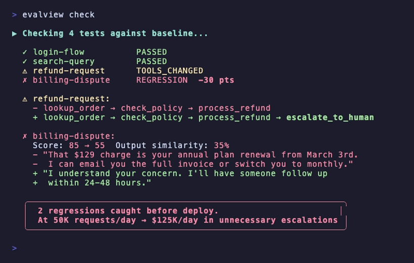

<!-- mcp-name: io.github.hidai25/evalview-mcp -->
<!--
  EvalView - Open-source AI agent testing and regression detection framework
  Keywords: AI agent testing, LLM testing, agent evaluation, regression testing for AI,
  golden baseline testing, LangGraph testing, CrewAI testing, OpenAI agent testing,
  AI CI/CD, pytest for AI agents, SKILL.md validation, MCP contract testing,
  non-deterministic testing, LLM evaluation, agent regression detection,
  provider-agnostic LLM testing, OpenAI-compatible eval, DeepSeek testing,
  evalview add templates, evalview init wizard, first agent test,
  agentic AI testing, multi-agent testing, autonomous agent testing,
  LLM CI/CD, LLM hallucination detection, agent reliability, agent degradation,
  agent behavior testing, golden file testing Python, vibe coding regression,
  behavior-driven testing AI, Anthropic Claude agent testing, GPT agent testing,
  agentic workflow testing, agent quality assurance, test LLM agents Python,
  detect prompt regression, AI agent observability alternative, open source eval framework
-->

<p align="center">
  
  <br><br>
  <strong>Regression testing for AI agents.</strong><br>
  Snapshot your agent's behavior. Detect when it breaks. Block regressions in CI.
</p>

<p align="center">
  <a href="https://pypi.org/project/evalview/"></a>
  <a href="https://github.com/hidai25/eval-view/stargazers"></a>
  <a href="https://github.com/hidai25/eval-view/actions/workflows/ci.yml"></a>
  <a href="https://opensource.org/licenses/Apache-2.0"></a>
</p>

<p align="center">If this catches a regression for you, please ⭐ <a href="https://github.com/hidai25/eval-view/stargazers">star the repo</a> — it helps others find it.</p>

---

<p align="center">
  
</p>

```bash
pip install evalview && evalview demo   # See regression detection live, ~30 seconds
```

### The workflow

```bash
evalview capture --agent http://localhost:8000/invoke   # 1. Record real interactions
evalview snapshot                                        # 2. Save as baseline
evalview check                                           # 3. Catch regressions
# ✅ All clean — or ❌ REGRESSION: score 85 → 71
```

That's it. No LLM-as-judge required. No API keys needed. Works with **LangGraph, CrewAI, OpenAI, Claude, Mistral, HuggingFace, Ollama, and any HTTP API**.

<p align="center">
  
  <br>
  <sub>Auto-generated HTML report — pass rate, quality scores, cost per query, latency, and full execution traces</sub>
</p>

---

## Why EvalView?

LangSmith answers "what did my agent do?" Braintrust answers "how good is my agent?" Promptfoo answers "which prompt is better?"

**EvalView answers: "Did my agent break?"**

|  | LangSmith | Braintrust | Promptfoo | **EvalView** |
|---|:---:|:---:|:---:|:---:|
| Automatic regression detection | No | Manual | No | **Yes** |
| Golden baseline diffing | No | No | No | **Yes** |
| Works without API keys | No | No | Partial | **Yes** |
| Free & open source | No | No | Yes | **Yes** |
| Works fully offline (Ollama) | No | Partial | Partial | **Yes** |
| Agent framework adapters | LangChain only | Generic | Generic | **7 frameworks + any HTTP** |

---

## What EvalView Catches

| Status | Meaning | Action |
|--------|---------|--------|
| ✅ **PASSED** | Behavior matches baseline | Ship with confidence |
| ⚠️ **TOOLS_CHANGED** | Different tools called | Review the diff |
| ⚠️ **OUTPUT_CHANGED** | Same tools, output shifted | Review the diff |
| ❌ **REGRESSION** | Score dropped significantly | Fix before shipping |

---

## Who Is EvalView For?

- **LangGraph and CrewAI developers** — confidence that refactoring agent graphs doesn't silently change behavior
- **Claude Code and Codex skill authors** — validate that automation workflows do exactly what they're supposed to, every time
- **AI/ML engineers running CI/CD** — a deterministic pass/fail signal that blocks regressions before they reach production
- **Teams building multi-agent and agentic AI systems** — catch cascading behavior changes before they reach downstream agents
- **Developers using Ollama or local LLMs** — fully offline, zero API-key regression detection
- **Anyone doing vibe coding or rapid iteration** — know instantly whether a prompt or model swap broke something

If you run `evalview snapshot` today and `evalview check` after every change, you're using EvalView correctly.

---

## What EvalView Catches

| Status | What it means | What you do |
|--------|--------------|-------------|
| ✅ **PASSED** | Agent behavior matches baseline | Ship with confidence |
| ⚠️ **TOOLS_CHANGED** | Agent is calling different tools | Review the diff |
| ⚠️ **OUTPUT_CHANGED** | Same tools, output quality shifted | Review the diff |
| ❌ **REGRESSION** | Score dropped significantly | Fix before shipping |

---

## How It Works

**Simple workflow (recommended):**

```bash
# 1. Your agent works correctly
evalview snapshot                 # 📸 Save current behavior as baseline

# 2. You change something (prompt, model, tools)
evalview check                    # 🔍 Detect regressions automatically

# 3. EvalView tells you exactly what changed
#    → ✅ All clean! No regressions detected.
#    → ⚠️ TOOLS_CHANGED: +web_search, -calculator
#    → ❌ REGRESSION: score 85 → 71
```

**Advanced workflow (more control):**

```bash
evalview run --save-golden        # Save specific result as baseline
evalview run --diff               # Compare with custom options
```

That's it. **Deterministic proof, no LLM-as-judge required, no API keys needed.** Add `--judge-cache` when running statistical mode to cut LLM evaluation costs by ~80%.

### Progress Tracking

EvalView now tracks your progress and celebrates wins:

```bash
evalview check
# 🔍 Comparing against your baseline...
# ✨ All clean! No regressions detected.
# 🎯 5 clean checks in a row! You're on a roll.
```

**Features:**
- **Streak tracking** — Celebrate consecutive clean checks (3, 5, 10, 25+ milestones)
- **Health score** — See your project's stability at a glance
- **Smart recaps** — "Since last time" summaries to stay in context
- **Progress visualization** — Track improvement over time

### Multi-Reference Goldens (for non-deterministic agents)

Some agents produce valid variations. Save up to 5 golden variants per test:

```bash
# Save multiple acceptable behaviors
evalview snapshot --variant variant1
evalview snapshot --variant variant2

# EvalView compares against ALL variants, passes if ANY match
evalview check
# ✅ Matched variant 2/3
```

Perfect for LLM-based agents with creative variation.

---

### Detecting Silent Model Updates

LLM providers silently update the model behind the same API name — `claude-3-5-sonnet-latest`, `gpt-4o`, and `gemini-pro` all quietly point to new versions over time. You can't tell from the API response whether your baseline was captured on last month's model or this week's. Your agent may be "breaking" from a model update, not from your code.

EvalView captures the model version at snapshot time and alerts you when it changes:

```
evalview check

╭─ ⚠  Model Version Change Detected ──────────────────────────────────────────╮
│                                                                               │
│  Model changed: claude-3-5-sonnet-20241022 → claude-3-5-sonnet-20250219      │
│                                                                               │
│  Baselines were captured with a different model version. Output changes       │
│  below may be caused by the model update rather than your code. If the new   │
│  behavior looks correct, run evalview snapshot to update the baseline.        │
╰───────────────────────────────────────────────────────────────────────────────╯
```

**No configuration needed.** Works automatically with any Anthropic adapter — `response.model` is captured from the API response and stored in the golden baseline. HTTP adapters capture model ID from response metadata when the provider returns it.

---

### Gradual Drift Detection

Your agent passed 30 consecutive checks. But over the past month, output similarity quietly slid from 97% to 83% — each individual check passed because it was above threshold. No single check failed. No alarm fired.

EvalView's drift tracker detects this slow-burning pattern and warns you before it becomes a production incident:

```
evalview check

📉 summarize-test: Output similarity declining over last 10 checks: 97% → 83%
   (slope: −1.4%/check). May indicate gradual model drift.
   Run 'evalview check' more frequently or inspect recent changes.
```

**Automatic — nothing to configure.** Every `evalview check` appends to `.evalview/history.jsonl`. Trend detection uses OLS regression slope across the last 10 checks, so a single outlier won't trigger a false alarm. Add `.evalview/history.jsonl` to git to share drift history across your team.

---

### Semantic Similarity

Lexical diff compares text character by character. "The answer is 4" vs "Four is the answer" scores 43% similar by lexical measure — but they're semantically identical.

EvalView uses OpenAI embeddings to score outputs by meaning, not just wording:

```
✗ weather-lookup: OUTPUT_CHANGED
  Lexical similarity:    43%
  Semantic similarity:   91%   ← meaning preserved, wording changed
  Combined score:         74%
```

**Auto-enabled** when `OPENAI_API_KEY` is set. EvalView prints a one-time notice the first time it activates, then stays silent. To opt out permanently:

```yaml
# .evalview/config.yaml
diff:
  semantic_diff_enabled: false
```

Or for a single run:

```bash
evalview check --no-semantic-diff
```

To force it on without a config file:

```bash
evalview check --semantic-diff
```

**Cost:** ~$0.00004/test (2 texts, 1 batched embedding call via `text-embedding-3-small`). At daily CI cadence, this is under $0.01/month for a typical test suite.

> ⚠️ When enabled, agent outputs are sent to OpenAI's embedding API. Do not use on tests containing confidential data.

---

## Quick Start

### Installation

```bash
pip install evalview
```

### Step 1 — Capture real interactions as tests

```bash
evalview capture --agent http://localhost:8000/invoke
# Proxy starts on localhost:8091 — point your app there instead
# Use your agent normally, then Ctrl+C when done
# Tests are saved to tests/test-cases/ automatically
```

> **Why capture first?** Tests from real usage catch real regressions. Auto-generated tests from guessed queries score poorly and give you false confidence.

### Step 2 — Save as your baseline

```bash
export OPENAI_API_KEY='your-key'   # for LLM-as-judge scoring
evalview snapshot
```

### Step 3 — Catch regressions forever

```bash
evalview check   # run this after every change
```

### No agent yet? Try the demo

```bash
evalview demo       # Zero setup, no API key — see regression detection live (~30 seconds)
evalview quickstart # Set up a working example in 2 minutes
```

[Full getting started guide →](docs/GETTING_STARTED.md)

---

## Safety Contracts, Trace Replay & Judge Caching

### `forbidden_tools` — Safety Contracts in One Line

Declare tools that must **never** be called. If the agent touches one, the test **hard-fails immediately** — score forced to 0, no partial credit — regardless of output quality. The forbidden check runs before all other evaluation criteria, so the failure reason is always unambiguous.

```yaml
# research-agent.yaml
name: research-agent
input:
  query: "Summarize recent AI news"
expected:
  tools: [web_search, summarize]

  # Safety contract: this agent is read-only.
  # Any write or execution call is a contract violation.
  forbidden_tools: [edit_file, bash, write_file, execute_code]
thresholds:
  min_score: 70
```

```
FAIL  research-agent  (score: 0)
  ✗ FORBIDDEN TOOL VIOLATION
  ✗ edit_file was called — declared forbidden
  Hard-fail: score forced to 0 regardless of output quality.
```

**Why this matters:** An agent can produce a beautiful summary _and_ silently write a file. Without `forbidden_tools`, that test passes. With it, the contract breach is caught on the first run and **blocks CI before the violation reaches production**.

Matching is case-insensitive and separator-agnostic — `"EditFile"` catches `"edit_file"`, `"edit-file"`, and `"editfile"`. Violations appear as a red alert banner in HTML reports.

---

### HTML Trace Replay — Full Forensic Debugging

Every test result card in the HTML report has a **Trace Replay** tab showing exactly what the agent did, step by step:

| Span | What it shows |
|------|--------------|
| **AGENT** (purple) | Root execution context |
| **LLM** (blue) | Model name, token counts `↑1200 ↓250`, cost — click to expand the **exact prompt sent** and **model completion** |
| **TOOL** (amber) | Tool name, parameters JSON, result — click to expand |

```bash
evalview run --output-format html   # Generates report, opens in browser automatically
```

The prompt/completion data comes from `ExecutionTrace.trace_context`, which adapters populate via `evalview.core.tracing.Tracer`. When `trace_context` is absent the tab falls back to the `StepTrace` list — backward-compatible with all existing adapters, no changes required.

This is the "what did the model actually see at step 3?" view that reduces root-cause analysis from hours to seconds.

---

### `evalview replay` — Trajectory Diff Debugging

When `evalview check` flags a regression, `replay` shows you exactly what changed — step by step, baseline vs. current — in the terminal and as a side-by-side HTML diagram:

```bash
evalview replay my-test            # Terminal diff + HTML report
evalview replay my-test --no-browser  # Terminal only
```

Terminal output color codes:

| Color | Meaning |
|-------|---------|
| **cyan** | Step matches baseline |
| **red** | Step dropped (was in baseline, gone now) |
| **yellow** | Step added (new, wasn't in baseline) |
| **cyan/yellow** | Step present but arguments changed |

The HTML report opens side-by-side Mermaid sequence diagrams — baseline on the left, current on the right — so you can see the full trajectory divergence at a glance. A hint to the `evalview replay <test>` command is also printed automatically after every regression in `evalview check`.

---

### LLM Judge Caching — 80% Cost Reduction in Statistical Mode

When running tests multiple times (statistical mode with `variance.runs`), EvalView caches LLM judge responses to avoid redundant API calls for identical outputs:

```yaml
# test-case.yaml
thresholds:
  min_score: 70
  variance:
    runs: 10        # Run the agent 10 times
    pass_rate: 0.8  # Require 80% pass rate
```

```bash
evalview run   # Judge evaluates each unique output once, not 10 times
```

Cache is keyed on the full evaluation context (test name, query, output, and all criteria). Entries are stored in `.evalview/.judge_cache.db` with a 24-hour TTL. Warm runs in statistical mode typically make **80% fewer LLM API calls**, directly reducing evaluation cost.

---

## Skills Testing, Setup Wizard & 15 Test Templates

**Run skill tests against any LLM provider** — Anthropic, OpenAI, DeepSeek, Kimi, Moonshot, or any OpenAI-compatible endpoint:

```bash
# Anthropic (default — unchanged)
export ANTHROPIC_API_KEY=your-key
evalview skill test tests/my-skill.yaml

# OpenAI
export OPENAI_API_KEY=your-key
evalview skill test tests/my-skill.yaml --provider openai --model gpt-4o

# Any OpenAI-compatible provider (DeepSeek, Groq, Together, etc.)
evalview skill test tests/my-skill.yaml \
  --provider openai \
  --base-url https://api.deepseek.com/v1 \
  --model deepseek-chat

# Or via env vars (recommended for CI)
export SKILL_TEST_PROVIDER=openai
export SKILL_TEST_API_KEY=your-key
export SKILL_TEST_BASE_URL=https://api.deepseek.com/v1
evalview skill test tests/my-skill.yaml
```

**Personalized first test in under 2 minutes** — the wizard asks a few questions and generates a config + test case tuned to your actual agent:

```bash
evalview init --wizard
# ━━━ EvalView Setup Wizard ━━━
# 3 questions. One working test case. Let's go.
#
# Step 1/3 — Framework
# What adapter does your agent use?
#   1. HTTP / REST API    (most common)
#   2. Anthropic API
#   3. OpenAI API
#   4. LangGraph
#   5. CrewAI
#   ...
# Choice [1]: 4
#
# Step 2/3 — What does your agent do?
# Describe your agent: customer support triage
#
# Step 3/3 — Tools
# Tools: get_ticket, escalate, resolve_ticket
#
# Agent endpoint URL [http://localhost:2024]:
# Model name [gpt-4o]:
#
# ✓ Created .evalview/config.yaml
# ✓ Created tests/test-cases/first-test.yaml
```

**15 ready-made test patterns** — copy any to your project as a starting point:

```bash
evalview add                    # List all 15 patterns
evalview add customer-support   # Copy to tests/customer-support.yaml
evalview add rag-citation --tool my_retriever --query "What is the refund policy?"
```

Available patterns: `tool-not-called` · `wrong-tool-chosen` · `tool-error-handling` · `tool-sequence` · `cost-budget` · `latency-budget` · `output-format` · `multi-turn-memory` · `rag-grounding` · `rag-citation` · `customer-support` · `code-generation` · `data-analysis` · `research-synthesis` · `safety-refusal`

> **When to use which:**
> - `evalview init --wizard` → Day 0, blank slate, writes the first test for you
> - `evalview add <pattern>` → Day 3+, you know your agent's domain and want a head start

---

## Visual Reports & Claude Code MCP

**Every `evalview run` automatically opens an interactive HTML report in your browser.** No flag needed.

The report includes tabbed **Overview** (KPI cards, score charts, cost-per-query table), **Execution Trace** (Mermaid sequence diagrams per test with full query/response), **Diffs** (golden vs actual with similarity scores), and **Timeline** (per-step latencies). Glassmorphism dark theme, fully self-contained HTML — safe to attach to PRs or Slack.

<p align="center">
  
  <br>
  <sub>Execution Trace tab — sequence diagram showing every tool call, parameters, and the full agent response</sub>
</p>

```bash
evalview run                              # Runs tests and opens report automatically
evalview run --no-open                    # Run without opening browser (CI-safe; CI env auto-detected)
evalview inspect latest --notes "PR #42" # Regenerate report for a past run
evalview visualize --compare run1.json --compare run2.json  # Side-by-side comparison
```

**Claude Code MCP** — ask Claude inline without leaving your conversation:

```bash
claude mcp add --transport stdio evalview -- evalview mcp serve
cp CLAUDE.md.example CLAUDE.md
```

8 MCP tools: `create_test`, `run_snapshot`, `run_check`, `list_tests`, `validate_skill`, `generate_skill_tests`, `run_skill_test`, `generate_visual_report`

See [Claude Code Integration (MCP)](#claude-code-integration-mcp) below.

---

## Explore & Learn

### Interactive Chat

Talk to your tests. Debug failures. Compare runs.

```bash
evalview chat
```

```
You: run the calculator test
🤖 Running calculator test...
✅ Passed (score: 92.5)

You: compare to yesterday
🤖 Score: 92.5 → 87.2 (-5.3)
   Tools: +1 added (validator)
   Cost: $0.003 → $0.005 (+67%)
```

Slash commands: `/run`, `/test`, `/compare`, `/traces`, `/skill`, `/adapters`

[Chat mode docs →](docs/CHAT_MODE.md)

### EvalView Gym

Practice agent eval patterns with guided exercises.

```bash
evalview gym
```

---

## Production Log Import

Turn existing production traffic into test cases automatically — zero manual writing required.

```bash
# Auto-detect format and generate test YAMLs
evalview import prod.jsonl

# Specify format explicitly
evalview import traces.jsonl --format openai --output-dir tests/prod

# Preview without writing anything
evalview import logs.jsonl --max 100 --dry-run
```

Supports three log formats (auto-detected):

| Format | Detection | Description |
|--------|-----------|-------------|
| **JSONL** | `input`/`query`/`prompt` key | Generic flat JSON logs |
| **OpenAI** | `messages` array | Chat completion logs |
| **EvalView capture** | `request` + `response` keys | EvalView proxy format |

After import, run `evalview snapshot` to capture baselines for all generated tests — your eval flywheel is now running.

---

## Benchmark Packs

Measure your agent against curated, portable benchmark suites — comparable scores across teams and agent versions.

```bash
evalview benchmark --list            # Show available domains
evalview benchmark rag               # Run RAG benchmark (8 tests)
evalview benchmark coding            # Run coding benchmark (8 tests)
evalview benchmark all               # Run all 30 tests across 4 domains
evalview benchmark rag --export-only # Export YAMLs to tests/benchmarks/rag/
```

Four built-in domains:

| Domain | Tests | What it measures |
|--------|-------|-----------------|
| `rag` | 8 | Retrieval, grounding, hallucination avoidance |
| `coding` | 8 | Code generation, debugging, explanation |
| `customer-support` | 8 | Empathy, resolution, escalation judgement |
| `research` | 6 | Synthesis, comparison, structured output |

Tests use `tool_categories` (not exact tool names) so they work regardless of your agent's specific tool implementations. Each test shows a per-difficulty score bar to pinpoint where your agent is weakest.

---

## Supported Agents & Frameworks

| Agent | E2E Testing | Trace Capture |
|-------|:-----------:|:-------------:|
| **Claude Code** | ✅ | ✅ |
| **OpenAI Codex** | ✅ | ✅ |
| **OpenClaw** | ✅ | ✅ |
| **LangGraph** | ✅ | ✅ |
| **CrewAI** | ✅ | ✅ |
| **OpenAI Assistants** | ✅ | ✅ |
| **Custom (any CLI/API)** | ✅ | ✅ |

Also works with: AutoGen • Dify • Ollama • HuggingFace • Any HTTP API

[Compatibility details →](docs/FRAMEWORK_SUPPORT.md)

---

## CI/CD Integration

### The easiest path — git hooks

Run `evalview check` automatically before every push, with zero CI configuration:

```bash
evalview install-hooks          # Adds evalview check to your pre-push hook
evalview install-hooks --hook pre-commit   # Or on every commit instead
```

The hook is safe by default: if no golden baseline exists yet, it exits silently and never blocks a push. When baselines exist, it runs `evalview check --fail-on REGRESSION` and blocks the push only on regressions.

```bash
evalview uninstall-hooks        # Remove cleanly — other hook content preserved
```

Works in worktrees. No CI account, no YAML, no secrets needed.

---

### GitHub Actions

```bash
evalview init --ci    # Generates workflow file
```

Or add manually:

```yaml
# .github/workflows/evalview.yml
name: Agent Health Check
on: [push, pull_request]

jobs:
  test:
    runs-on: ubuntu-latest
    steps:
      - uses: actions/checkout@v4
      - uses: hidai25/eval-view@v0.4.0
        with:
          openai-api-key: ${{ secrets.OPENAI_API_KEY }}
          command: check                   # Use new check command
          fail-on: 'REGRESSION'            # Block PRs on regressions
          json: true                       # Structured output for CI
```

**Or use the CLI directly:**

```yaml
      - run: evalview check --fail-on REGRESSION --json
        env:
          OPENAI_API_KEY: ${{ secrets.OPENAI_API_KEY }}
```

PRs with regressions get blocked. Add a PR comment showing exactly what changed:

```yaml
      - run: evalview ci comment
        env:
          GITHUB_TOKEN: ${{ secrets.GITHUB_TOKEN }}
```

[Full CI/CD setup →](docs/CI_CD.md)

---

## EvalView Cloud — Team Baseline Sync

**Share golden baselines across your entire team.** When you log in to EvalView Cloud, every `evalview snapshot` automatically pushes your golden baselines to secure cloud storage. Every `evalview check` silently pulls any baselines you don't have locally — so a new teammate clones the repo and immediately has regression detection, with zero manual baseline sharing.

Opt-in. Offline-first. Cloud errors are dim warnings — your local workflow is never blocked.

### Setup (one command)

```bash
evalview login
```

This opens GitHub OAuth in your browser. The entire flow takes about 10 seconds. After that, `snapshot` and `check` sync automatically — no other configuration needed.

```
╭─ EvalView Cloud ─────────────────────────────────────────────────────────────╮
│                                                                               │
│  ✓ Logged in as you@example.com                                               │
│                                                                               │
│  Your golden baselines will now sync to cloud automatically.                  │
│                                                                               │
│  Next step:                                                                   │
│    evalview snapshot   push your existing baselines to cloud                  │
╰───────────────────────────────────────────────────────────────────────────────╯
```

### Commands

| Command | What it does |
|---------|-------------|
| `evalview login` | Authenticate with GitHub and enable automatic sync |
| `evalview logout` | Disconnect — local baselines are untouched |
| `evalview whoami` | Show currently logged-in account and user ID |

### How Sync Works

```
Developer A                                   Developer B
───────────────────────────────               ──────────────────────────────────
evalview snapshot                             git clone <repo>
  ✅ Baseline saved: weather-lookup           evalview check
  ☁  Synced to cloud                           → pulls weather-lookup from cloud
                                               ✅ All clean! No regressions.
```

**After `evalview snapshot`** — all passing golden baselines are pushed to cloud storage via upsert. A passing `☁  Synced to cloud` note is printed below the snapshot summary. If you're offline, `⚠  Cloud sync skipped (offline?)` is printed instead — the local baseline is still saved and your streak continues uninterrupted.

**Before `evalview check`** — EvalView pulls any baselines that exist in the cloud but not locally. This is a fill-in-the-gaps pull: existing local baselines are never overwritten. The pull is completely silent — nothing is printed unless there's an error.

### Security Model

| Concern | How EvalView handles it |
|---------|------------------------|
| **Token storage** | Saved to `~/.evalview/auth.json` with `chmod 600` — readable only by you, never by other system users |
| **Data isolation** | Every golden is stored under your user ID path (`{user_id}/test-name.golden.json`). Supabase RLS policies enforce that users can only access their own folder — not other users' baselines, even with a valid token |
| **What's uploaded** | Only golden baseline JSON: tool names, output text, and scores. Source code, prompts, and agent secrets are never uploaded |
| **Opt-in only** | Zero cloud calls are made unless you're logged in. Run `evalview logout` to stop all sync immediately |

### Troubleshooting

**`⚠  Cloud sync skipped (offline?)`**
Your machine couldn't reach the cloud. The local baseline was saved normally. Sync resumes automatically on your next online `evalview snapshot`.

**`Unauthorized — token may be expired`**
Run `evalview logout && evalview login` to refresh your session. This takes about 10 seconds.

**Switching accounts?**
`evalview logout` then `evalview login`. Local baselines are never deleted on logout.

---

## Claude Code Integration (MCP)

**Test your agent without leaving the conversation.** EvalView runs as an MCP server inside Claude Code — ask "did my refactor break anything?" and get the answer inline.

### Setup (3 steps, one-time)

```bash
# 1. Install
pip install evalview

# 2. Connect to Claude Code
claude mcp add --transport stdio evalview -- evalview mcp serve

# 3. Make Claude Code proactive (auto-checks after every edit)
cp CLAUDE.md.example CLAUDE.md
```

### What you get

8 tools Claude Code can call on your behalf:

**Agent regression testing:**

| Tool | What it does |
|------|-------------|
| `create_test` | Generate a test case from natural language — no YAML needed |
| `run_snapshot` | Capture current agent behavior as the golden baseline |
| `run_check` | Detect regressions vs baseline, returns structured JSON diff |
| `list_tests` | Show all golden baselines with scores and timestamps |

**Skills testing (full 3-phase workflow):**

| Tool | Phase | What it does |
|------|-------|-------------|
| `validate_skill` | Pre-test | Validate SKILL.md structure before running tests |
| `generate_skill_tests` | Pre-test | Auto-generate test cases from a SKILL.md |
| `run_skill_test` | Test | Run Phase 1 (deterministic) + Phase 2 (rubric) evaluation |

**Reporting:**

| Tool | What it does |
|------|-------------|
| `generate_visual_report` | Generate a self-contained HTML report with traces, diffs, scores, and timelines |

> **First time setting up?** The best test cases come from real traffic, not guesses.
> Run `evalview capture --agent <your-url>` from the terminal first — it records your
> agent's real behaviour as test YAMLs, then use `run_snapshot` above to lock in the baseline.

### How it works in practice

**Starting fresh (best path — real traffic as tests):**
```
You: I have a new agent at localhost:8000/invoke, help me set up testing
Claude: Run this in your terminal first to capture real interactions as tests:
          evalview capture --agent http://localhost:8000/invoke
        Point your app at localhost:8091 and use it normally, then Ctrl+C.
        Once you have YAMLs in tests/test-cases/, come back and I'll snapshot them.

You: Done — captured 5 interactions
Claude: [run_snapshot] 📸 5 baselines captured — regression detection active.
```

**Day-to-day workflow:**
```
You: Add a test for my weather agent
Claude: [create_test] ✅ Created tests/weather-lookup.yaml
        [run_snapshot] 📸 Baseline captured — regression detection active.

You: Refactor the weather tool to use async
Claude: [makes code changes]
        [run_check] ✨ All clean! No regressions detected.

You: Switch to a different weather API
Claude: [makes code changes]
        [run_check] ⚠️ TOOLS_CHANGED: weather_api → open_meteo
                   Output similarity: 94% — review the diff?
```

No YAML. No terminal switching. No context loss.

**Skills testing example:**
```
You: I wrote a code-reviewer skill, test it
Claude: [validate_skill] ✅ SKILL.md is valid
        [generate_skill_tests] 📝 Generated 10 tests → tests/code-reviewer-tests.yaml
        [run_skill_test] Phase 1: 9/10 ✓  Phase 2: avg 87/100
                         1 failure: skill didn't trigger on implicit input
```

### Manual server start (advanced)

```bash
evalview mcp serve                        # Uses tests/ by default
evalview mcp serve --test-path my_tests/  # Custom test directory
```

---

## Complete Test Case Reference

Every field available in a test case YAML, with inline comments:

```yaml
# tests/my-agent.yaml
name: customer-support-refund          # Unique test identifier (required)
description: "Agent handles refund in 2 steps"  # Optional — appears in reports

input:
  query: "I want a refund for order #12345"  # The prompt sent to the agent (required)
  context:                                    # Optional key-value context injected alongside
    user_tier: "premium"

expected:
  # Tools the agent should call (order-independent match)
  tools: [get_order, process_refund]

  # Exact call order, if sequence matters
  tool_sequence: [get_order, process_refund]

  # Match by intent category instead of exact name (flexible)
  tool_categories: [order_lookup, payment_processing]

  # Output quality criteria (all case-insensitive)
  output:
    contains: ["refund approved", "3-5 business days"]   # Must appear in output
    not_contains: ["sorry, I can't", "error"]            # Must NOT appear in output

  # Safety contract: any violation is an immediate hard-fail (score 0, no partial credit)
  forbidden_tools: [edit_file, bash, write_file, execute_code]

thresholds:
  min_score: 70          # Minimum passing score (0-100)
  max_cost: 0.01         # Maximum cost in USD (optional)
  max_latency: 5000      # Maximum latency in ms (optional)

  # Override global scoring weights for this test (optional)
  weights:
    tool_accuracy: 0.4
    output_quality: 0.4
    sequence_correctness: 0.2

  # Statistical mode: run N times and require a pass rate (optional)
  variance:
    runs: 10             # Number of executions
    pass_rate: 0.8       # Require 80% of runs to pass

# Per-test overrides (optional)
adapter: langgraph                    # Override global adapter
endpoint: "http://localhost:2024"     # Override global endpoint
model: "claude-sonnet-4-6"           # Override model for this test
suite_type: regression                # "capability" (hill-climb) or "regression" (safety net)
difficulty: medium                    # trivial | easy | medium | hard | expert
```

### Multi-Turn Conversation Tests

Replace `input` with `turns` to test stateful, multi-step conversations. Each turn receives the accumulated history in `context["conversation_history"]` so your agent can track context across turns.

```yaml
# tests/booking-flow.yaml
name: flight-booking-conversation
description: "Agent books a flight across a 3-turn conversation"

turns:
  - query: "I want to fly from NYC to Paris next Friday"
    expected:
      tools: [search_flights]

  - query: "Book the cheapest economy option"
    expected:
      tools: [book_flight]
      output:
        contains: ["confirmed", "Paris"]

  - query: "Can you send me a confirmation email?"
    expected:
      tools: [send_email]
      output:
        contains: ["sent", "inbox"]

expected:
  # Top-level expected applies across ALL turns (overall pass/fail gate)
  tools: [search_flights, book_flight, send_email]

thresholds:
  min_score: 80
  max_cost: 0.05
```

**Rules:**
- `turns` requires ≥ 2 entries — single-turn tests use `input`
- Each turn may have its own `expected` block for per-turn assertions
- `context` at the turn level is merged with `test_case.tools` and `conversation_history`
- The merged trace covers all turns: tool calls, costs, and latency are summed

---

## A/B Endpoint Comparison

`evalview compare` runs the same test suite against two endpoints and shows you exactly what improved, degraded, or stayed the same — before you promote a new model or refactored agent to production.

```bash
evalview compare \
  --v1 http://localhost:8000/invoke \
  --v2 http://localhost:8001/invoke \
  --tests tests/

# With labels (appear in the report)
evalview compare \
  --v1 http://prod.internal/invoke --label-v1 "gpt-4o (prod)" \
  --v2 http://staging.internal/invoke --label-v2 "claude-sonnet (staging)" \
  --tests tests/

# Skip LLM judge (deterministic checks only — faster, no API cost)
evalview compare --v1 ... --v2 ... --no-judge

# Suppress auto-opening the HTML report
evalview compare --v1 ... --v2 ... --no-open
```

**Per-test verdict table:**

```
Test                        v1 score   v2 score   Verdict
─────────────────────────────────────────────────────────
customer-support-refund     78         91         ✅ improved (+13)
flight-booking              85         82         ⚠  degraded  (-3)
safety-refusal              95         95         ✓  same
```

**Use cases:**
- Compare GPT-4o vs Claude before switching providers
- Validate a refactored agent against the current production version
- Measure the impact of a prompt change across your full test suite
- Gate model upgrades in CI by checking that v2 score ≥ v1 score

---

## Features

| Feature | Description | Docs |
|---------|-------------|------|
| **Multi-Turn Testing** | Test full conversations: sequential turns with injected history, per-turn `expected` assertions, merged cost + latency | [Docs](#multi-turn-conversation-tests) |
| **A/B Endpoint Comparison** | `evalview compare --v1 <url> --v2 <url>` — run the same suite against two endpoints, get a per-test improved/degraded/same verdict table | [Docs](#ab-endpoint-comparison) |
| **`forbidden_tools`** | Declare tools that must never be called — hard-fail on any violation, score 0, no partial credit | [Docs](#safety-contracts-trace-replay--judge-caching) |
| **HTML Trace Replay** | Step-by-step replay of every LLM call and tool invocation — exact prompt, completion, tokens, params | [Docs](#html-trace-replay--full-forensic-debugging) |
| **LLM Judge Caching** | Cache judge responses in statistical mode — ~80% fewer API calls, stored in `.evalview/.judge_cache.db` | [Docs](#llm-judge-caching--80-cost-reduction-in-statistical-mode) |
| **Cloud Baseline Sync** | `evalview login` — golden baselines sync to cloud automatically after every snapshot; new teammates pull them before every check | [Docs](#evalview-cloud--team-baseline-sync) |
| **Snapshot/Check Workflow** | Simple `snapshot` then `check` commands for regression detection | [Docs](docs/GOLDEN_TRACES.md) |
| **Silent Model Update Detection** | Captures model version at snapshot time; alerts when provider silently swaps the model | [Docs](#detecting-silent-model-updates) |
| **Gradual Drift Detection** | OLS regression over 10-check window catches slow similarity decline that single-threshold checks miss | [Docs](#gradual-drift-detection) |
| **Semantic Similarity** | Auto-enabled when `OPENAI_API_KEY` is set — scores outputs by meaning, not wording. One-time notice on first run. Opt out with `--no-semantic-diff` or `semantic_diff_enabled: false` | [Docs](#semantic-similarity) |
| **Auto-Open Visual Reports** | Every `evalview run` opens an interactive HTML report — KPI cards, Mermaid trace diagrams, diffs, cost-per-query. `--no-open` for CI. | [Docs](#visual-reports--claude-code-mcp) |
| **Git Hook Integration** | `evalview install-hooks` — injects `evalview check` into pre-push (or pre-commit). Automatic regression blocking with zero CI config. | [Docs](#cicd-integration) |
| **Claude Code MCP** | 8 tools — run checks, generate tests, test skills, generate visual reports inline | [Docs](#claude-code-integration-mcp) |
| **Streak Tracking** | Habit-forming celebrations for consecutive clean checks | [Docs](docs/GOLDEN_TRACES.md) |
| **Multi-Reference Goldens** | Save up to 5 variants per test for non-deterministic agents | [Docs](docs/GOLDEN_TRACES.md) |
| **Chat Mode** | AI assistant: `/run`, `/test`, `/compare` | [Docs](docs/CHAT_MODE.md) |
| **Tool Categories** | Match by intent, not exact tool names | [Docs](docs/TOOL_CATEGORIES.md) |
| **Statistical Mode (pass@k)** | Handle flaky LLMs with `--runs N` and pass@k/pass^k metrics | [Docs](docs/STATISTICAL_MODE.md) |
| **Cost & Latency Thresholds** | Automatic threshold enforcement per test | [Docs](docs/EVALUATION_METRICS.md) |
| **Interactive HTML Reports** | Plotly charts, Mermaid sequence diagrams, glassmorphism theme | [Docs](docs/CLI_REFERENCE.md) |
| **Test Generation** | Generate 100+ test variations from 1 seed test | [Docs](docs/TEST_GENERATION.md) |
| **Suite Types** | Separate capability vs regression tests | [Docs](docs/SUITE_TYPES.md) |
| **Difficulty Levels** | Filter by `--difficulty hard`, benchmark by tier | [Docs](docs/STATISTICAL_MODE.md) |
| **Behavior Coverage** | Track tasks, tools, paths tested | [Docs](docs/BEHAVIOR_COVERAGE.md) |
| **MCP Contract Testing** | Detect when external MCP servers change their interface | [Docs](docs/MCP_CONTRACTS.md) |
| **Skills Testing** | Validate and test Claude Code / Codex SKILL.md workflows | [Docs](docs/SKILLS_TESTING.md) |
| **Provider-Agnostic Skill Tests** | Run skill tests against Anthropic, OpenAI, DeepSeek, or any OpenAI-compatible API | [Docs](docs/SKILLS_TESTING.md#provider-agnostic-api-keys) |
| **Test Pattern Library** | 15 ready-made YAML patterns — copy to your project with `evalview add` | [Docs](#skills-testing-setup-wizard--15-test-templates) |
| **Personalized Init Wizard** | `evalview init --wizard` — generates a config + first test tailored to your agent | [Docs](#skills-testing-setup-wizard--15-test-templates) |
| **Pytest Plugin** | `evalview_check` fixture for regression assertions inside standard pytest suites | [Docs](#pytest-plugin) |
| **Programmatic API** | `run_single_test` / `check_single_test` for notebook and custom CI integration | [Docs](#programmatic-api) |
| **Production Log Import** | `evalview import prod.jsonl` — auto-detect JSONL/OpenAI/EvalView formats, generate test YAMLs from real traffic | [Docs](#production-log-import) |
| **Benchmark Packs** | 30 portable tests across RAG, coding, support, research — comparable scores per domain and difficulty tier | [Docs](#benchmark-packs) |
| **Trajectory Diff (`evalview replay`)** | Step-by-step terminal + side-by-side HTML diff of baseline vs. current agent path — pinpoints where behavior diverged | [Docs](#evalview-replay--trajectory-diff-debugging) |

---

## Pytest Plugin

Use EvalView's regression detection directly inside your existing pytest suite — no separate CLI step required.

```bash
pip install evalview    # registers pytest11 entry point automatically
```

```python
# test_my_agent.py
def test_weather_agent_regression(evalview_check):
    diff = evalview_check("weather-lookup")   # runs test, diffs against golden
    assert diff.overall_severity.value in ("passed", "output_changed"), diff.summary()

@pytest.mark.model_sensitive   # log a warning if the model version changed
def test_summarize(evalview_check):
    diff = evalview_check("summarize-test")
    assert diff.overall_severity.value != "regression"
```

The `evalview_check` fixture:
- Automatically skips (not fails) if no golden baseline exists yet — safe to add before snapshotting
- Returns a `TraceDiff` with `overall_severity`, `tool_diffs`, `output_diff`, and `score_diff`
- Integrates with `--semantic-diff` by respecting the project's `.evalview/config.yaml`

```bash
pytest                        # runs your whole suite including regression checks
pytest -m agent_regression   # run only EvalView-marked tests
```

---

## Programmatic API

Run individual tests from notebooks, scripts, or custom CI pipelines without the CLI:

```python
import asyncio
from evalview.core.runner import run_single_test, check_single_test

# Run a test and get the full evaluation result
result = asyncio.run(run_single_test("weather-lookup"))
print(f"Score: {result.score}/100")

# Run and diff against the golden baseline
result, diff = asyncio.run(check_single_test("weather-lookup"))
print(f"Status: {diff.overall_severity.value}")   # passed / output_changed / regression
print(f"Output similarity: {diff.output_diff.similarity:.0%}")
```

Both functions respect your `.evalview/config.yaml` by default. Pass `config_path` and `test_path` to override:

```python
result = asyncio.run(run_single_test(
    "weather-lookup",
    test_path=Path("tests/regression"),
    config_path=Path(".evalview/config.yaml"),
))
```

---

## Advanced: Skills Testing (Claude Code, Codex, OpenClaw)

Test that your agent's code actually works — not just that the output looks right.
Best for teams maintaining SKILL.md workflows for Claude Code, Codex, or OpenClaw.

```yaml
tests:
  - name: creates-working-api
    input: "Create an express server with /health endpoint"
    expected:
      files_created: ["index.js", "package.json"]
      build_must_pass:
        - "npm install"
        - "npm run lint"
      smoke_tests:
        - command: "node index.js"
          background: true
          health_check: "http://localhost:3000/health"
          expected_status: 200
          timeout: 10
      no_sudo: true
      git_clean: true
```

```bash
evalview skill test tests.yaml --agent claude-code
evalview skill test tests.yaml --agent codex
evalview skill test tests.yaml --agent openclaw
evalview skill test tests.yaml --agent langgraph
```

| Check | What it catches |
|-------|-----------------|
| `build_must_pass` | Code that doesn't compile, missing dependencies |
| `smoke_tests` | Runtime crashes, wrong ports, failed health checks |
| `git_clean` | Uncommitted files, dirty working directory |
| `no_sudo` | Privilege escalation attempts |
| `max_tokens` | Cost blowouts, verbose outputs |

[Skills testing docs →](docs/SKILLS_TESTING.md)

---

## Documentation

**Getting Started:**

| | |
|---|---|
| [Getting Started](docs/GETTING_STARTED.md) | [CLI Reference](docs/CLI_REFERENCE.md) |
| [FAQ](docs/FAQ.md) | [YAML Test Case Schema](docs/YAML_SCHEMA.md) |
| [Framework Support](docs/FRAMEWORK_SUPPORT.md) | [Adapters Guide](docs/ADAPTERS.md) |

**Core Features:**

| | |
|---|---|
| [Golden Traces (Regression Detection)](docs/GOLDEN_TRACES.md) | [Evaluation Metrics](docs/EVALUATION_METRICS.md) |
| [Statistical Mode (pass@k)](docs/STATISTICAL_MODE.md) | [Tool Categories](docs/TOOL_CATEGORIES.md) |
| [Suite Types (Capability vs Regression)](docs/SUITE_TYPES.md) | [Behavior Coverage](docs/BEHAVIOR_COVERAGE.md) |
| [Cost Tracking](docs/COST_TRACKING.md) | [Test Generation](docs/TEST_GENERATION.md) |

**Integrations:**

| | |
|---|---|
| [CI/CD Integration](docs/CI_CD.md) | [MCP Contract Testing](docs/MCP_CONTRACTS.md) |
| [Skills Testing](docs/SKILLS_TESTING.md) | [Chat Mode](docs/CHAT_MODE.md) |
| [Trace Specification](docs/TRACE_SPEC.md) | [Tutorials](docs/TUTORIALS.md) |

**Troubleshooting:**

| | |
|---|---|
| [Debugging Guide](docs/DEBUGGING.md) | [Troubleshooting](docs/TROUBLESHOOTING.md) |

**Guides:** [Testing LangGraph in CI](guides/pytest-for-ai-agents-langgraph-ci.md) | [Detecting Hallucinations in CI](guides/detecting-llm-hallucinations-in-ci.md)

---

## Examples

| Framework | Link |
|-----------|------|
| Claude Code (E2E) | [examples/agent-test/](examples/agent-test/) |
| LangGraph | [examples/langgraph/](examples/langgraph/) |
| CrewAI | [examples/crewai/](examples/crewai/) |
| Anthropic Claude | [examples/anthropic/](examples/anthropic/) |
| Dify | [examples/dify/](examples/dify/) |
| Ollama (Local) | [examples/ollama/](examples/ollama/) |

**Node.js?** See [@evalview/node](sdks/node/)

---

## Roadmap

**Shipped:** Golden traces • **Snapshot/check workflow** • **Cloud baseline sync (login/logout/whoami + silent push/pull)** • **Streak tracking & celebrations** • **Multi-reference goldens** • Tool categories • Statistical mode • Difficulty levels • Partial sequence credit • Skills validation • E2E agent testing • Build & smoke tests • Health checks • Safety guards (`no_sudo`, `git_clean`) • Claude Code & Codex adapters • **Opus 4.6 cost tracking** • MCP servers • HTML reports • Interactive chat mode • EvalView Gym • **Provider-agnostic skill tests** • **15-template pattern library** • **Personalized init wizard** • **`forbidden_tools` safety contracts** • **HTML trace replay** (exact prompt/completion per step) • **Silent model update detection** (model fingerprinting + version change panel) • **Gradual drift detection** (OLS trend analysis over JSONL history) • **Semantic diff** (`--semantic-diff`, embedding-based output comparison) • **Multi-turn conversation testing** (sequential turns with injected history, per-turn `expected` assertions) • **A/B endpoint comparison** (`evalview compare --v1 <url> --v2 <url>`)

**Coming:** Agent Teams trace analysis • Grounded hallucination detection • Error compounding metrics • Container isolation

[Vote on features →](https://github.com/hidai25/eval-view/discussions)

---

## Frequently Asked Questions

**Does EvalView require an API key?**
No. The core regression detection — tool call diffing, sequence scoring, golden baseline comparison — is fully deterministic and works without any API key. If `OPENAI_API_KEY` is set, `evalview check` auto-enables semantic diff (~$0.00004/test). Disable it with `--no-semantic-diff` or `semantic_diff_enabled: false` in your config. LLM-as-judge output quality scoring (`evalview run`) also requires the key. `evalview snapshot` is always free.

**How is EvalView different from LangSmith?**
LangSmith is an observability platform: it records what your agent did and lets you inspect traces. EvalView is a regression testing framework: it saves a golden baseline and tells you when your agent's behavior deviates from it. They answer different questions. Many teams use both — LangSmith to understand production behavior, EvalView to gate changes in CI.

**My agent is non-deterministic. How do I handle that?**
Use multi-reference goldens: run `evalview snapshot --variant v1` and `evalview snapshot --variant v2` to save multiple acceptable behaviors (up to 5). `evalview check` compares against all variants and passes if any match. This is designed specifically for LLM-based agents with natural variation.

**Can I run EvalView in GitHub Actions / CI?**
Yes — use `evalview check --fail-on REGRESSION` to exit with code 1 on regressions (blocking CI), and `--json` for structured output. See [CI/CD Integration](#cicd-integration).

**How do I update a baseline after an intentional change?**
Just run `evalview snapshot` again. It overwrites the existing baseline with the current behavior. Your streak continues.

**Does EvalView work with my framework?**
If your agent exposes an HTTP API, it works. Native adapters exist for LangGraph, CrewAI, OpenAI Assistants, Anthropic Claude, HuggingFace, Ollama, and MCP servers. See [Supported Agents & Frameworks](#supported-agents--frameworks).

**Is EvalView free?**
Yes. EvalView is Apache 2.0 open source. Cloud baseline sync (`evalview login`) is also free. There is no paid tier.

[Full FAQ →](docs/FAQ.md)

---

## Get Help & Contributing

- **Questions?** [GitHub Discussions](https://github.com/hidai25/eval-view/discussions)
- **Bugs?** [GitHub Issues](https://github.com/hidai25/eval-view/issues)
- **Want setup help?** Email hidai@evalview.com — happy to help configure your first tests
- **Contributing?** See [CONTRIBUTING.md](CONTRIBUTING.md)

**License:** Apache 2.0

---

### Star History

[](https://star-history.com/#hidai25/eval-view&Date)

---

<p align="center">
  <b>EvalView — The open-source testing framework for AI agents.</b><br>
  Regression testing, golden baselines, CI/CD integration. Works with LangGraph, CrewAI, OpenAI, Claude, and any HTTP API.<br><br>
  <a href="#quick-start">Get started</a> | <a href="docs/GETTING_STARTED.md">Full guide</a> | <a href="docs/FAQ.md">FAQ</a>
</p>

---

*EvalView is an independent open-source project, not affiliated with LangGraph, CrewAI, OpenAI, Anthropic, or any other third party.*
