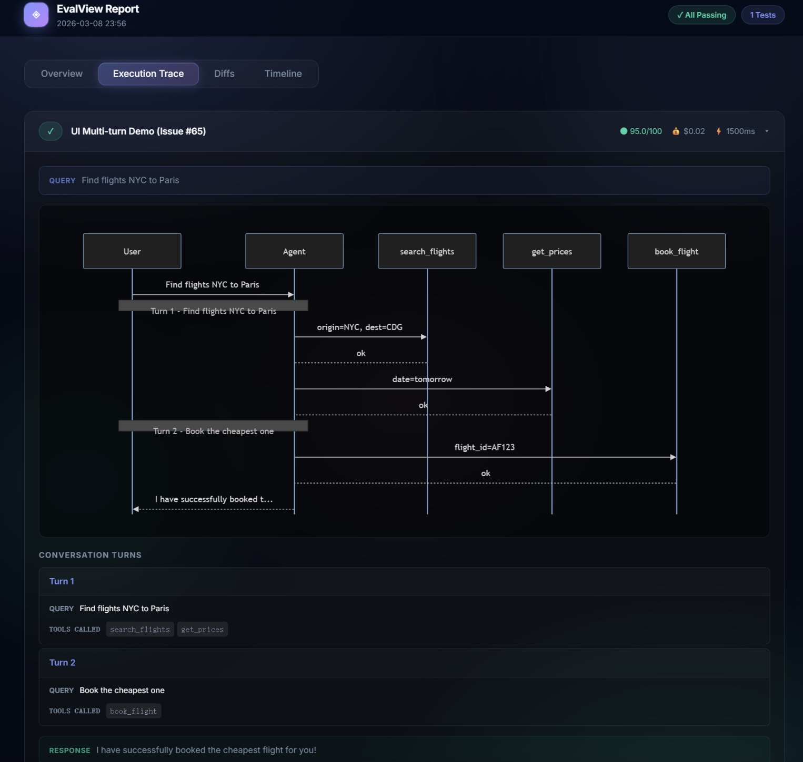

<!-- mcp-name: io.github.hidai25/evalview-mcp -->
<!-- keywords: AI agent testing, regression detection, golden baselines -->

<p align="center">
  
  <br>
  <strong>The open-source regression gate for AI agents.</strong><br>
  Think Playwright, but for tool-calling and multi-turn AI agents.
</p>

<p align="center">
  <a href="https://pypi.org/project/evalview/"></a>
  <a href="https://pypi.org/project/evalview/"></a>
  <a href="https://github.com/hidai25/eval-view/stargazers"></a>
  <a href="https://github.com/hidai25/eval-view/actions/workflows/ci.yml"></a>
  <a href="https://opensource.org/licenses/Apache-2.0"></a>
  <a href="https://github.com/hidai25/eval-view/graphs/contributors"></a>
</p>

---

Your agent returns `200` but silently takes the wrong tool path, skips a clarification, or degrades output quality after a model update. Normal tests don't catch this. **EvalView does.**

```
  ✓ login-flow           PASSED
  ⚠ refund-request       TOOLS_CHANGED
      - lookup_order → check_policy → process_refund
      + lookup_order → check_policy → process_refund → escalate_to_human
  ✗ billing-dispute      REGRESSION  -30 pts
      Score: 85 → 55  Output similarity: 35%
```

<p align="center">
  
</p>

## Quick Start

```bash
pip install evalview
```

```bash
evalview init        # Detect agent, auto-configure profile + starter suite
evalview snapshot    # Save current behavior as baseline
evalview check       # Catch regressions after every change
```

That's it. Three commands to regression-test any AI agent. `init` auto-detects your agent type (chat, tool-use, multi-step, RAG, coding) and configures the right evaluators, thresholds, and assertions.

<details>
<summary><strong>Other install methods</strong></summary>

```bash
# One-line install
curl -fsSL https://raw.githubusercontent.com/hidai25/eval-view/main/install.sh | bash
```

</details>

<details>
<summary><strong>No agent yet? Try the demo</strong></summary>

```bash
evalview demo        # See regression detection live (~30 seconds, no API key)
```

Or clone a real working agent with built-in tests:

```bash
git clone https://github.com/hidai25/evalview-support-automation-template
cd evalview-support-automation-template
make run
```

</details>

<details>
<summary><strong>More entry paths</strong></summary>

```bash
# Generate tests from a live agent
evalview generate --agent http://localhost:8000

# Capture real user flows via proxy (runs assertion wizard after)
evalview capture --agent http://localhost:8000/invoke

# Capture a multi-turn conversation as one test
evalview capture --agent http://localhost:8000/invoke --multi-turn

# Generate from existing logs
evalview generate --from-log traffic.jsonl

# Override auto-detected agent profile
evalview init --profile rag
```

</details>

## What It Catches

| Status | Meaning | Action |
|--------|---------|--------|
| ✅ **PASSED** | Behavior matches baseline | Ship with confidence |
| ⚠️ **TOOLS_CHANGED** | Different tools called | Review the diff |
| ⚠️ **OUTPUT_CHANGED** | Same tools, output shifted | Review the diff |
| ❌ **REGRESSION** | Score dropped significantly | Fix before shipping |

## How It Works

```
┌────────────┐      ┌──────────┐      ┌──────────────┐
│ Test Cases  │ ──→  │ EvalView │ ──→  │  Your Agent   │
│   (YAML)   │      │          │ ←──  │ local / cloud │
└────────────┘      └──────────┘      └──────────────┘
```

1. **`evalview init`** — detects your running agent, creates a starter test suite
2. **`evalview snapshot`** — runs tests, saves traces as baselines (picks judge model on first run)
3. **`evalview check`** — replays tests, diffs against baselines, opens HTML report with results
4. **`evalview watch`** — re-runs checks on every file save during local dev
5. **`evalview monitor`** — runs checks continuously in production with Slack alerts

<details>
<summary><strong>Snapshot management</strong></summary>

```bash
evalview snapshot list              # See all saved baselines
evalview snapshot show "my-test"    # Inspect a baseline
evalview snapshot delete "my-test"  # Remove a baseline
evalview snapshot --preview         # See what would change without saving
evalview snapshot --reset           # Clear all and start fresh
evalview replay                     # List tests, or: evalview replay "my-test"
```

</details>

**Your data stays local by default.** Nothing leaves your machine unless you opt in to cloud sync via `evalview login`.

## CI/CD Integration

Block broken agents in every PR. One step — PR comments, artifacts, and job summary are automatic.

```yaml
# .github/workflows/evalview.yml — copy this, add your secret, done
name: EvalView Agent Check
on: [pull_request, push]

jobs:
  agent-check:
    runs-on: ubuntu-latest
    permissions:
      pull-requests: write
    steps:
      - uses: actions/checkout@v4

      - name: Check for agent regressions
        uses: hidai25/eval-view@main
        with:
          openai-api-key: ${{ secrets.OPENAI_API_KEY }}
```

That's it. The action automatically:
- Runs `evalview check` against your golden baselines
- Posts/updates a PR comment with pass/fail, tool diffs, cost/latency alerts
- Writes a job summary visible in the Actions UI
- Uploads results + HTML report as artifacts

Common options: `strict: 'true'` | `fail-on: 'REGRESSION,TOOLS_CHANGED'` | `mode: 'run'` | `filter: 'my-test'` | `post-comment: 'false'`

**What lands on your PR:**

```
## ✅ EvalView: PASSED

| Metric | Value |
|--------|-------|
| Tests | 5/5 unchanged (100%) |

---
*Generated by EvalView*
```

When something breaks:

```
## ❌ EvalView: REGRESSION

> **Alerts**
> - 💸 Cost spike: $0.02 → $0.08 (+300%)
> - 🤖 Model changed: gpt-5.4 → gpt-5.4-mini

| Metric | Value |
|--------|-------|
| Tests | 3/5 unchanged (60%) |
| Regressions | 1 |
| Tools Changed | 1 |
| Model Changed | gpt-5.4 → gpt-5.4-mini |

### Changes from Baseline
- ❌ **search-flow**: score -15.0, 1 tool change(s)
- ⚠️ **create-flow**: 1 tool change(s)
```

**Status badge** — shows live check status in your README:

```bash
evalview badge            # Generate .evalview/badge.json
git add .evalview/badge.json && git commit -m "add evalview badge"
```

Then add to your README (replace `USER/REPO`):

```markdown

```

The badge auto-updates every time `evalview check` runs. Commit the JSON and the GitHub Action keeps it fresh.

**Pre-push hooks** — zero CI config:

```bash
evalview install-hooks    # Pre-push regression blocking
```

[Full CI/CD guide →](docs/CI_CD.md)

## Watch Mode

Leave it running while you code. Every file save triggers a regression check with a live dashboard.

```bash
evalview watch                          # Watch current dir, check on change
evalview watch --quick                  # No LLM judge — $0, sub-second
evalview watch --path src/ --path tests/
evalview watch --test "refund-flow"     # Only check one test
evalview watch --sound                  # Terminal bell on regression
```

```
╭─────────────────────────── EvalView Watch ────────────────────────────╮
│   Watching   .                                                        │
│   Tests      all in tests/                                            │
│   Mode       quick (no judge, $0)                                     │
│   Debounce   2.0s                                                     │
╰───────────────────────────────────────────────────────────────────────╯

14:32:07  Change detected: src/agent.py

╭──────────────────────────── Scorecard ────────────────────────────────╮
│ ████████████████████░░░░  4 passed · 1 tools changed · 0 regressions │
╰───────────────────────────────────────────────────────────────────────╯
  ⚠ TOOLS_CHANGED  refund-flow  1 tool change(s)

Watching for changes...
```

Uses the same `gate()` API as the Python library — no subprocess overhead.

## Multi-Turn Testing

Most eval tools handle single-turn well. EvalView is built for multi-turn agents — clarification paths, follow-up handling, and tool use across conversations.

```yaml
name: refund-needs-order-number
turns:
  - query: "I want a refund"
    expected:
      output:
        contains: ["order number"]
  - query: "Order 4812"
    expected:
      tools: ["lookup_order", "check_policy"]
      forbidden_tools: ["delete_order"]
      output:
        contains: ["refund", "processed"]
        not_contains: ["error"]
thresholds:
  min_score: 70
```

Each turn is evaluated independently — tool usage, forbidden tools, output content, and **LLM judge scoring per turn** (not just the final response). The judge sees conversation history for context but scores each turn against its own query:

```
Turn 1 (92/100) ✓: Correctly processed refund, grounded in tool results
Turn 2 (90/100) ✓: Clear timeline, consistent with turn 1
Turn 3 (85/100) ✓: Appropriate escalation advice
```

No more false low scores from judging turn 3's answer against turn 1's question.

Capture multi-turn conversations from real traffic:

```bash
evalview capture --agent http://localhost:8000/invoke --multi-turn
```

## Supported Frameworks

Works with **LangGraph, CrewAI, OpenAI, Claude, Mistral, HuggingFace, Ollama, MCP, and any HTTP API**.

| Agent | E2E Testing | Trace Capture |
|-------|:-----------:|:-------------:|
| LangGraph | ✅ | ✅ |
| CrewAI | ✅ | ✅ |
| OpenAI Assistants | ✅ | ✅ |
| Claude Code | ✅ | ✅ |
| OpenClaw | ✅ | ✅ |
| Ollama | ✅ | ✅ |
| Any HTTP API | ✅ | ✅ |

[Framework details →](docs/FRAMEWORK_SUPPORT.md) | [Flagship starter →](https://github.com/hidai25/evalview-support-automation-template) | [Starter examples →](examples/)

## Why EvalView?

Use LangSmith for observability. Use Braintrust for scoring. **Use EvalView for regression gating.**

|  | LangSmith | Braintrust | Promptfoo | **EvalView** |
|---|:---:|:---:|:---:|:---:|
| **Primary focus** | Observability | Scoring | Prompt comparison | **Regression detection** |
| Tool call + parameter diffing | — | — | — | **Yes** |
| Golden baseline regression | — | Manual | — | **Automatic** |
| PR comments with alerts | — | — | — | **Cost, latency, model change** |
| Works without API keys | No | No | Partial | **Yes** |
| Production monitoring | Tracing | — | — | **Check loop + Slack** |

[Detailed comparisons →](docs/COMPARISONS.md)

## Four Scoring Layers

| Layer | What it checks | Needs API key? | Cost |
|-------|---------------|:--------------:|------|
| **Tool calls + sequence** | Exact tool names, order, parameters | No | Free |
| **Code-based checks** | Regex, JSON schema, contains/not_contains | No | Free |
| **Semantic similarity** | Output meaning via embeddings | `OPENAI_API_KEY` | ~$0.00004/test |
| **LLM-as-judge** | Output quality scored by LLM | Any provider key | ~$0.01/test |

The first two layers alone catch most regressions — fully offline, zero cost. The LLM judge supports GPT-5.4, Claude Opus/Sonnet, Gemini, DeepSeek, Grok, and Ollama (free local). EvalView asks which model to use on first run, or use `--judge sonnet`.

Every test shows a score breakdown so you know exactly what pulled the score down:

```
Score Breakdown
  Tools 100% ×30%    Output 42/100 ×50%    Sequence ✓ ×20%    = 54/100
  ↑ tools were fine   ↑ this is the problem
```

## Two Modes, One CLI

EvalView has two complementary ways to test your agent:

### Regression Gating — *"Did my agent change?"*

Snapshot known-good behavior, then detect when something drifts.

```bash
evalview snapshot              # Capture current behavior as baseline
evalview check                 # Compare against baseline after every change
evalview check --budget 0.50   # Stop mid-run if budget exceeded
evalview check --statistical 10 --auto-variant  # Discover + save non-deterministic paths
evalview check --judge opus    # Use a specific judge model (sonnet, gpt-5.4, deepseek...)
evalview watch --quick         # Re-run checks on every file save ($0, sub-second)
evalview monitor               # Continuous checks with Slack alerts
```

### Evaluation — *"How good is my agent?"*

Auto-generate tests and score your agent's quality right now.

```bash
evalview generate           # LLM generates realistic tests from your agent
evalview run                # Execute tests, score with LLM judge, get HTML report
```

Both modes start the same way: `evalview demo` → `evalview init` → then pick your path.

## Production Monitoring

```bash
evalview monitor                                         # Check every 5 min
evalview monitor --interval 60                           # Every minute
evalview monitor --slack-webhook https://hooks.slack.com/services/...
evalview monitor --history monitor.jsonl                 # JSONL for dashboards
```

New regressions trigger Slack alerts. Recoveries send all-clear. No spam on persistent failures.

[Monitor config options →](docs/CLI_REFERENCE.md)

## Smart DX — Zero-Config Testing That Gets It Right

EvalView doesn't just run tests — it **understands your agent** and configures itself. Four features that make the difference between "another eval tool" and the one you actually use.

### 1. Assertion Wizard — Tests From Real Traffic, Not Guesses

Capture real user interactions, and EvalView analyzes the traffic to suggest smart assertions automatically.

```bash
evalview capture --agent http://localhost:8000/invoke
# Use your agent normally, then Ctrl+C
```

```
Assertion Wizard — analyzing 8 captured interactions

  Agent type detected: multi-step

  Capture Analysis
    Interactions        8
    Tools seen          search, extract, summarize
    Avg tools/call      3.2
    Consistent sequence search -> extract -> summarize
    Avg latency         2340ms

  Suggested assertions:

    1. Lock tool sequence: search -> extract -> summarize  (recommended)
    2. Require tools: search, extract, summarize           (recommended)
    3. Max latency: 5000ms                                 (recommended)
    4. Reject error outputs                                (recommended)
    5. Minimum quality score: 70                           (recommended)

  Accept all recommended? [Y]es / [n]o (pick individually) / [s]kip wizard: y

  Applied 5 assertions to 8 test files
```

No YAML writing. No guessing what to assert. Your tests come pre-configured from real behavior.

### 2. Auto-Variant Discovery — Solve Non-Determinism Automatically

Non-deterministic agents take different valid paths. Instead of manually capturing each one, let EvalView discover them:

```bash
evalview check --statistical 10 --auto-variant
```

```
Statistical mode: running each test 10 times...

  search-flow  mean: 82.3, std: 8.1, flakiness: low_variance
    1. search -> extract -> summarize       (7/10 runs = 70%, pass rate: 100%, avg score: 85.2)
    2. search -> summarize                  (3/10 runs = 30%, pass rate: 100%, avg score: 78.1)

    Found 1 distinct path to save as variant:
      * search -> summarize (3 occurrences)
    Save as golden variant? [Y/n]: y
    Saved variant 'auto-v1': search -> summarize
```

Run N times. Cluster the paths. Save the valid ones. Your tests stop being flaky — automatically.

### 3. Budget Circuit Breaker — Stop Spending Before It's Too Late

Budget isn't checked *after* all tests run. It's enforced **mid-execution** — the moment you hit the limit, remaining tests are skipped.

```bash
evalview check --budget 0.50
```

```
  $0.12 (24%) — search-flow
  $0.09 (18%) — refund-flow
  $0.31 (62%) — billing-dispute

  Budget circuit breaker tripped: $0.52 spent of $0.50 limit
  2 test(s) skipped to stay within budget
```

Per-test cost breakdown shows you exactly where the money goes. No more surprise bills from runaway eval loops.

### 4. Smart Eval Profiles — The Right Config for Your Agent Type

`evalview init` detects your agent type and pre-configures the right evaluators, thresholds, and assertions:

```bash
evalview init
```

```
  Agent Profile

    Multi-Step Agent — Agent with complex tool chains (3+ tools per query)
    Detected tools: search, extract, summarize

    Recommended checks:
      Output Quality    enabled
      Hallucination     enabled
      Tool Accuracy     enabled
      Sequence Check    enabled
      Safety            skip
      PII Detection     skip

    Tips for this agent type:
      * Use tool_sequence to catch ordering regressions
      * Consider evalview snapshot --variant for non-deterministic paths
      * Set a cost budget — multi-step agents can get expensive
      * Use --statistical 5 periodically to measure variance
```

Five profiles — `chat`, `tool-use`, `multi-step`, `rag`, `coding` — each with tailored thresholds, recommended checks, and actionable tips. Override with `--profile rag` if auto-detection is wrong.

---

## Key Features

| Feature | Description | Docs |
|---------|-------------|------|
| **Assertion wizard** | Analyze captured traffic, suggest smart assertions automatically | [Above](#1-assertion-wizard--tests-from-real-traffic-not-guesses) |
| **Auto-variant discovery** | Run N times, cluster paths, save valid variants | [Above](#2-auto-variant-discovery--solve-non-determinism-automatically) |
| **Budget circuit breaker** | Mid-execution budget enforcement with per-test cost breakdown | [Above](#3-budget-circuit-breaker--stop-spending-before-its-too-late) |
| **Smart eval profiles** | Auto-detect agent type, pre-configure evaluators | [Above](#4-smart-eval-profiles--the-right-config-for-your-agent-type) |
| **Baseline diffing** | Tool call + parameter + output regression detection | [Docs](docs/GOLDEN_TRACES.md) |
| **Multi-turn testing** | Per-turn tool, forbidden_tools, and output checks | [Docs](#multi-turn-testing) |
| **Multi-reference baselines** | Up to 5 variants for non-deterministic agents | [Docs](docs/GOLDEN_TRACES.md) |
| **`forbidden_tools`** | Safety contracts — hard-fail on any violation | [Docs](docs/YAML_SCHEMA.md) |
| **Watch mode** | `evalview watch` — re-run checks on file save, with dashboard | [Docs](#watch-mode) |
| **Python API** | `gate()` / `gate_async()` — programmatic regression checks | [Docs](#python-api) |
| **PR comments + alerts** | Cost/latency spikes, model changes, collapsible diffs | [Docs](docs/CI_CD.md) |
| **Terminal dashboard** | Scorecard, sparkline trends, confidence scoring | — |

<details>
<summary><strong>All features</strong></summary>

| Feature | Description | Docs |
|---------|-------------|------|
| **Multi-turn capture** | `capture --multi-turn` records conversations as tests | [Docs](#multi-turn-testing) |
| **Semantic similarity** | Embedding-based output comparison | [Docs](docs/EVALUATION_METRICS.md) |
| **Production monitoring** | `evalview monitor` with Slack alerts and JSONL history | [Docs](#production-monitoring) |
| **A/B comparison** | `evalview compare --v1 <url> --v2 <url>` | [Docs](docs/CLI_REFERENCE.md) |
| **Test generation** | `evalview generate` — discovers your agent's domain, generates relevant tests | [Docs](docs/TEST_GENERATION.md) |
| **Per-turn judge scoring** | Multi-turn output quality scored per turn with conversation context | [Docs](#multi-turn-testing) |
| **Silent model detection** | Alerts when LLM provider updates the model version | [Docs](docs/GOLDEN_TRACES.md) |
| **Gradual drift detection** | Trend analysis across check history | [Docs](docs/GOLDEN_TRACES.md) |
| **Statistical mode (pass@k)** | Run N times, require a pass rate, auto-discover variants | [Docs](docs/STATISTICAL_MODE.md) |
| **HTML trace replay** | Auto-opens after check with full trace details | [Docs](docs/CLI_REFERENCE.md) |
| **Verified cost tracking** | Per-test cost breakdown with model pricing rates | [Docs](docs/COST_TRACKING.md) |
| **Judge model picker** | Choose GPT, Claude, Gemini, DeepSeek, or Ollama (free) | [Docs](docs/EVALUATION_METRICS.md) |
| **Pytest plugin** | `evalview_check` fixture for standard pytest | [Docs](#pytest-plugin) |
| **GitHub Actions job summary** | Results visible in Actions UI, not just PR comments | [Docs](docs/CI_CD.md) |
| **Git hooks** | Pre-push regression blocking, zero CI config | [Docs](docs/CI_CD.md) |
| **LLM judge caching** | ~80% cost reduction in statistical mode | [Docs](docs/EVALUATION_METRICS.md) |
| **Quick mode** | `gate(quick=True)` — no judge, $0, sub-second | [Docs](#python-api) |
| **OpenClaw integration** | Regression gate skill + `gate_or_revert()` helpers | [Docs](#openclaw-integration) |
| **Snapshot preview** | `evalview snapshot --preview` — dry-run before saving | — |
| **Skills testing** | E2E testing for Claude Code, Codex, OpenClaw | [Docs](docs/SKILLS_TESTING.md) |

</details>

## Python API

Use EvalView as a library — no CLI, no subprocess, no output parsing.

```python
from evalview import gate, DiffStatus

result = gate(test_dir="tests/")

result.passed          # bool — True if no regressions
result.status          # DiffStatus.PASSED / REGRESSION / TOOLS_CHANGED
result.summary         # .total, .unchanged, .regressions, .tools_changed
result.diffs           # List[TestDiff] — per-test scores and tool diffs
```

**Quick mode** — skip the LLM judge for free, sub-second checks:

```python
result = gate(test_dir="tests/", quick=True)  # deterministic only, $0
```

**Async** — for agent frameworks already in an event loop:

```python
result = await gate_async(test_dir="tests/")
```

**Autonomous loops** — gate + auto-revert on regression:

```python
from evalview.openclaw import gate_or_revert

make_code_change()
if not gate_or_revert("tests/", quick=True):
    # Change was reverted — try a different approach
    try_alternative()
```

## OpenClaw Integration

Use EvalView as a regression gate in autonomous agent loops.

```bash
evalview openclaw install                    # Install gate skill into workspace
evalview openclaw check --path tests/        # Check and auto-revert on regression
```

Or programmatically:

```python
from evalview.openclaw import gate_or_revert

make_code_change()
if not gate_or_revert("tests/", quick=True):
    try_alternative()  # Change was reverted
```

## Pytest Plugin

```python
def test_weather_regression(evalview_check):
    diff = evalview_check("weather-lookup")
    assert diff.overall_severity.value != "regression", diff.summary()
```

```bash
pip install evalview    # Plugin registers automatically
pytest                  # Runs alongside your existing tests
```

## Claude Code (MCP)

```bash
claude mcp add --transport stdio evalview -- evalview mcp serve
```

8 tools: `create_test`, `run_snapshot`, `run_check`, `list_tests`, `validate_skill`, `generate_skill_tests`, `run_skill_test`, `generate_visual_report`

<details>
<summary><strong>MCP setup details</strong></summary>

```bash
# 1. Install
pip install evalview

# 2. Connect to Claude Code
claude mcp add --transport stdio evalview -- evalview mcp serve

# 3. Make Claude Code proactive
cp CLAUDE.md.example CLAUDE.md
```

Then just ask Claude: "did my refactor break anything?" and it runs `run_check` inline.

</details>

## Documentation

| Getting Started | Core Features | Integrations |
|---|---|---|
| [Getting Started](docs/GETTING_STARTED.md) | [Golden Traces](docs/GOLDEN_TRACES.md) | [CI/CD](docs/CI_CD.md) |
| [CLI Reference](docs/CLI_REFERENCE.md) | [Evaluation Metrics](docs/EVALUATION_METRICS.md) | [MCP Contracts](docs/MCP_CONTRACTS.md) |
| [FAQ](docs/FAQ.md) | [Test Generation](docs/TEST_GENERATION.md) | [Skills Testing](docs/SKILLS_TESTING.md) |
| [YAML Schema](docs/YAML_SCHEMA.md) | [Statistical Mode](docs/STATISTICAL_MODE.md) | [Chat Mode](docs/CHAT_MODE.md) |
| [Framework Support](docs/FRAMEWORK_SUPPORT.md) | [Behavior Coverage](docs/BEHAVIOR_COVERAGE.md) | [Debugging](docs/DEBUGGING.md) |

## Contributing

- **Bug or feature request?** Run `evalview feedback` or [open an issue](https://github.com/hidai25/eval-view/issues)
- **Questions?** [GitHub Discussions](https://github.com/hidai25/eval-view/discussions)
- **Setup help?** Email hidai@evalview.com
- **Contributing?** See [CONTRIBUTING.md](CONTRIBUTING.md)

**License:** Apache 2.0

---

### Star History

[](https://star-history.com/#hidai25/eval-view&Date)
