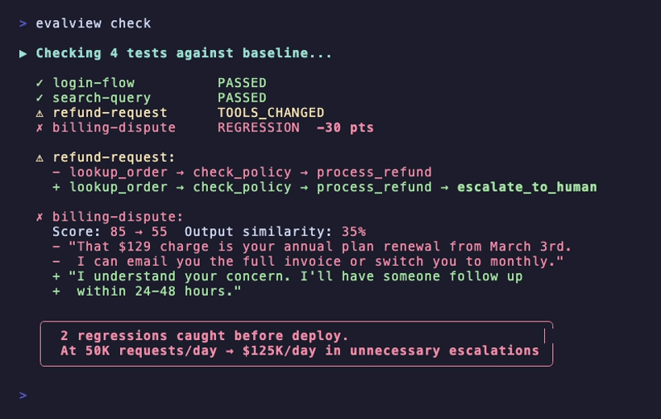

<!-- mcp-name: io.github.hidai25/evalview-mcp -->
<!-- keywords: AI agent testing, regression detection, golden baselines -->

<p align="center">
  
  <br>
  <strong>Snapshot testing for AI agents.</strong><br>
  Record what your agent does today. Get told when it silently changes.
</p>

<p align="center">
  <a href="https://pypi.org/project/evalview/"></a>
  <a href="https://pypi.org/project/evalview/"></a>
  <a href="https://github.com/hidai25/eval-view/actions/workflows/ci.yml"></a>
  <a href="https://github.com/hidai25/eval-view/actions/workflows/dogfood.yml"></a>
  <a href="https://github.com/hidai25/eval-view/actions/workflows/dogfood-live.yml"></a>
  <a href="https://github.com/hidai25/eval-view/stargazers"></a>
  <a href="https://opensource.org/licenses/Apache-2.0"></a>
</p>

---

Your agent returns `200` and looks fine. But a model update, a provider change, or a one-line prompt edit just made it skip a clarification, call the wrong tool, or quietly drop output quality. Your tests still pass. Your users notice before you do.

**EvalView snapshots your agent's behavior — the tools it calls, in what order, with what output — and tells you the moment that behavior changes.** Like Jest snapshots, but for tool-calling, multi-turn agents.

[](https://github.com/user-attachments/assets/96d8b5f7-3561-44a1-86a4-270fb0d1d8a6)

<sub>↑ 30-second live demo — no API key needed</sub>

## Quick Start

> **OpenAI adapter migration:** OpenAI shut down the Assistants API on **August 26, 2026**.
> The latest published EvalView release, **0.8.1**, still uses that API; the Responses API
> migration is currently **unreleased source**. If you use `openai-assistants`, follow the
> [migration guide](docs/OPENAI_MIGRATION.md) before running your tests. An `assistant_id`
> alone cannot preserve your agent's configuration. Other adapters are unaffected.

```bash
pip install evalview
```

```bash
evalview snapshot    # Record your agent's current behavior as the baseline
evalview check       # After any change, diff against the baseline
```

That's the whole loop. `check` returns one of:

```
  ✓ login-flow        PASSED          behavior matches baseline
  ⚠ refund-request    TOOLS_CHANGED   called a different tool, or in a different order
  ✗ billing-dispute   REGRESSION      score dropped — output quality fell
```

It diffs the **whole trajectory** — tool names, parameters, and order — not just the final string. The deterministic tool + sequence diff runs offline, with no API key. Add an LLM judge only when you want output-quality scoring.

Executing your agent can still incur backend API charges: `--no-judge` skips the
judge, not those calls. Embedding-based semantic comparison is opt-in.

No agent yet? See it work in 30 seconds:

```bash
evalview demo
```

## Why snapshot testing (and not assertions)?

Most eval tools ask you to *write down what "good" looks like* — assertions, metrics, rubrics. That's a lot of upfront work, and you can only catch the failures you thought to assert.

EvalView inverts it: **it records what your agent actually does now, and flags any drift from that.** You catch regressions you never anticipated, with zero assertions written. When the new behavior is correct, `evalview snapshot` accepts it as the new baseline — same as updating a snapshot in Jest.

| | EvalView | Assertion-based eval tools |
|---|---|---|
| Setup | Record current behavior | Write assertions/metrics first |
| Catches | Any drift from baseline | Only what you asserted |
| Non-determinism | Multi-variant baselines (up to 5 valid paths) | You handle it |
| Unit of comparison | Full tool-call trajectory | Usually final output |

This makes EvalView a **merge-time regression gate**, which is a different job from observability (Langfuse, LangSmith) or metric scoring (promptfoo, DeepEval, Braintrust). Many teams run one of those for visibility **and** EvalView as the gate. [Honest comparisons →](docs/COMPARISONS.md)

## EvalView tests itself in public, every day

Every day at 09:00 UTC, on pull requests, and on pushes to main,
[Core Dogfood](.github/workflows/dogfood.yml) exercises the non-live test suite,
type checks, local mock-agent `snapshot` / `check`, `evalview demo`, end-to-end
flows, and an `evalview monitor` smoke test. It uses no paid API credentials and
makes no paid inference calls. GitHub runner usage is separate.

[Live Provider Checks](.github/workflows/dogfood-live.yml) test the real evaluator and
chat assistant only when a maintainer explicitly opts into paid API use on main.
They have no automatic schedule. Their badge records the last manual run; a green
core badge does not establish live-provider health or rule out provider drift.

Package CI, core dogfood, and live checks have separate badges. Failed or incomplete
checks remain visible within their scope, with logs and reports preserved as
artifacts. Rolling issues use separate `dogfood-core` and `dogfood-live` labels.
A provider outage, exhausted quota, or missing credential means live health is
unavailable; it does not prove an agent regression.

The historical [incident #264](https://github.com/hidai25/eval-view/issues/264)
remains available for maintainer review of fresh evidence from both scopes. Neither
workflow automatically closes it. Trust warnings are evidence to investigate,
not proof of gaming or of a particular root cause.

[Core runs →](https://github.com/hidai25/eval-view/actions/workflows/dogfood.yml) · [Manual live runs →](https://github.com/hidai25/eval-view/actions/workflows/dogfood-live.yml) · [Run and triage guide →](docs/INTERNAL_DOGFOODING.md#daily-failure-triage)

## CI: block regressions in every PR

```yaml
# .github/workflows/evalview.yml
name: EvalView
on: [pull_request]
jobs:
  agent-check:
    runs-on: ubuntu-latest
    permissions: { pull-requests: write }
    steps:
      - uses: actions/checkout@v4
      - uses: hidai25/eval-view@v0.8.1
        with:
          openai-api-key: ${{ secrets.OPENAI_API_KEY }}
```

You get a PR comment with the diff, cost/latency deltas, and a pass/fail gate. [CI/CD guide →](docs/CI_CD.md)

## Works with your stack

LangGraph · CrewAI · OpenAI · Claude · Mistral · Ollama · MCP · **any HTTP API**.

```bash
evalview check --agent http://localhost:8000/invoke
```

[Framework details →](docs/FRAMEWORK_SUPPORT.md)

## Use it as a library

```python
from evalview import gate

result = gate(test_dir="tests/")
result.passed   # bool
result.diffs    # per-test scores and tool diffs
```

[Python API →](docs/CLI_REFERENCE.md#python-api)

## More

EvalView also does multi-turn testing, statistical/pass@k runs, record/replay cassettes, model-drift canaries, production monitoring with Slack alerts, and auto-generated regression tests from incidents. These are power-user features — start with `snapshot` and `check`, reach for the rest when you need them.

→ [Full feature reference](docs/CLI_REFERENCE.md) · [Getting Started](docs/GETTING_STARTED.md) · [FAQ](docs/FAQ.md)

→ [Documentation index](docs/README.md) · [OpenAI migration](docs/OPENAI_MIGRATION.md) · [Release process](docs/RELEASING.md)

### Why I built EvalView

An agent that looked successful kept pulling entire documents into its context and made one question cost $42.93. That experience led me to build EvalView. I wrote about it in [“I Was Running an AI Casino. Then I Started Writing Tests for My Agents”](https://medium.com/@hidaibarmor/i-was-running-an-ai-casino-then-i-started-writing-tests-for-my-agents-93cb3468ce1e). The December 2025 post is the origin story; use the current docs for setup and commands.

## Contributing

This is a young project built mostly by one developer. Issues, PRs, and "I tried it and X was confusing" feedback are all genuinely valuable.

- [Open an issue](https://github.com/hidai25/eval-view/issues) · [Discussions](https://github.com/hidai25/eval-view/discussions) · [CONTRIBUTING.md](CONTRIBUTING.md)

**License:** Apache 2.0

---

[](https://star-history.com/#hidai25/eval-view&Date)
